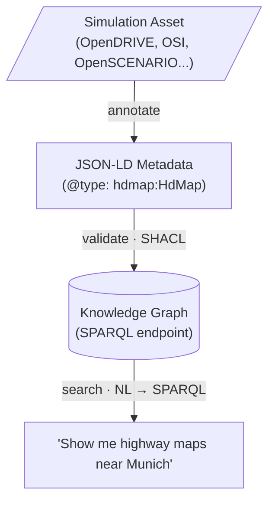

# Ontology Management Base

[](https://github.com/ASCS-eV/ontology-management-base/actions/workflows/ci-quality.yml)
[](https://ascs-ev.github.io/ontology-management-base/)

Ontologies for **discovering and describing simulation assets** in the [ENVITED-X](https://envited-x.net/) data space, maintained by the Automotive Solution Center for Simulation e.V. ([ASCS](https://www.asc-s.de/)). Compliant with [Gaia-X 25.11](https://gitlab.com/gaia-x/technical-committee/service-characteristics-working-group/service-characteristics).

> **Note:** This repository is the active development home, forked from [GAIA-X4PLC-AAD/ontology-management-base](https://github.com/GAIA-X4PLC-AAD/ontology-management-base) (archived after `v0.1.0`).

## What This Does

These ontologies define **searchable metadata** for simulation assets (HD maps, scenarios, sensor traces, environment models). They enable:

- **Natural language search** — "find all German motorway maps with 3+ lanes" → [ontology-based-nl-search](https://github.com/ASCS-eV/ontology-based-nl-search)
- **Structured annotation** — describe your assets so others can find them → [sl-5-8-asset-tools](https://github.com/openMSL/sl-5-8-asset-tools)
- **Cross-domain discovery** — find scenarios that reference a specific HD map
- **Quality validation** — ensure metadata annotations are complete and correct (SHACL)

The ontology is **not** a copy of the ASAM OpenDRIVE/OpenSCENARIO data model. It's a metadata layer that summarizes what's inside data files — a 100MB OpenDRIVE file is described by ~2KB of searchable `hdmap:HdMap` metadata.

## Who Uses This

| Role | Activity | Tool |
|------|----------|------|
| **Data Searcher** | Find assets by properties (NL or structured) | [NL Search App](https://github.com/ASCS-eV/ontology-based-nl-search) |
| **Data Creator** | Annotate assets with metadata for discovery | [Asset Tools](https://github.com/openMSL/sl-5-8-asset-tools) |
| **Ontology Developer** | Extend the metadata schema for new domains | This repository |

## How It Works



## Getting Started

**New to this project?** Start with the [install, test, build guide](https://ascs-ev.github.io/ontology-management-base/getting-started/install-test-build/).

**Looking for ontologies?** Browse the [ontology catalog](https://ascs-ev.github.io/ontology-management-base/ontologies/catalog/).

**Need technical details?** See [concepts](https://ascs-ev.github.io/ontology-management-base/ontologies/concepts/) and [validation strategy](https://ascs-ev.github.io/ontology-management-base/validation/strategy/).

## Quick Links

- **[Full Documentation](https://ascs-ev.github.io/ontology-management-base/)** — Complete guides and references
- **[Validation](https://ascs-ev.github.io/ontology-management-base/validation/strategy/)** — Run checks on your data
- **[Contributing](https://ascs-ev.github.io/ontology-management-base/getting-started/contribute/)** — How to add or modify ontologies
- **[ASAM OpenX Standards](https://github.com/ASCS-eV/asam-openx-standards)** — Source standard references (submodule)
- **[Gaia-X 4 PLC-AAD](https://ascs-ev.github.io/ontology-management-base/gaiax/gaiax4plc-aad/)** — Federated catalog upload flow

## What's in This Repository

- **Ontologies** — OWL definitions with SHACL validation shapes (`artifacts/`)
- **Validation Tools** — Python suite to validate metadata instances (`omb/`)
- **Test Data** — Valid and invalid examples per domain (`tests/data/`)
- **Documentation** — Guides, architecture, and specifications (`docs/`)
- **Standard References** — ASAM OpenX specs as submodule (`submodules/asam-openx-standards/`)

## Requirements

- **Python ≥ 3.12** (required — older versions will fail with syntax errors)
- **Git**
- **uv** ([installation guide](https://docs.astral.sh/uv/getting-started/installation/))
- **just** ([installation packages](https://just.systems/man/en/packages.html))

## Installation

```bash
git clone https://github.com/ASCS-eV/ontology-management-base.git
cd ontology-management-base

# One-command setup (creates .venv, installs dev dependencies, and pre-commit hooks)
just setup
```

No activation is required for `just` recipes; they run through `uv run`. Activate the environment only for direct Python or pip commands:

```bash
# Linux / macOS / Git Bash
source .venv/bin/activate

# Windows PowerShell
.venv\Scripts\Activate.ps1

# Windows CMD
.venv\Scripts\activate.bat
```

## Validation

```bash
# Validate test data
just test

# See validation options
python3 -m omb.validators.validation_suite --help

# Validate specific domain
just test-domain hdmap

# See all just recipes
just --list
```

## Local Docs Build

```bash
# Preview locally
DOCS_SITE_URL=http://127.0.0.1:8000/ontology-management-base just docs-serve

# Build static docs site
just docs-build
```

Notes:

Hook flow (via `hooks/copy_artifacts.py`):

1. The hook runs `properties_updater` and `class_page_generator` (DOCS_SITE_URL is optional and only affects local diagram links).
2. `properties_updater` writes tracked `artifacts/<domain>/PROPERTIES.md`, generates `docs/ontologies/properties/<domain>.md` (ignored by git), builds the `docs/ontologies/properties.md` domains overview, and refreshes `docs/ontologies/catalog.md`.
3. `class_page_generator` writes `docs/ontologies/classes/<domain>/*.md` and uses `DOCS_SITE_URL` to build local diagram links.
4. The hook copies `artifacts/<domain>/` into `docs/artifacts/<domain>/<versionInfo>/` and adds example instances from `tests/data/`.

## Maintained Ontologies

<!-- START_CATALOG_TABLE -->
| Ontology / Resource IRI | Local Artifact File |
| :--- | :--- |
| `https://openlabel.asam.net/V1-0-0/ontologies/` | [openlabel/openlabel.owl.ttl](artifacts/openlabel/openlabel.owl.ttl) |
| `https://openlabel.asam.net/V1-0-0/ontologies/context` | [openlabel/openlabel.context.jsonld](artifacts/openlabel/openlabel.context.jsonld) |
| `https://openlabel.asam.net/V1-0-0/ontologies/shapes` | [openlabel/openlabel.shacl.ttl](artifacts/openlabel/openlabel.shacl.ttl) |
| `https://w3id.org/ascs-ev/envited-x/environment-model/v5` | [environment-model/environment-model.owl.ttl](artifacts/environment-model/environment-model.owl.ttl) |
| `https://w3id.org/ascs-ev/envited-x/environment-model/v5/context` | [environment-model/environment-model.context.jsonld](artifacts/environment-model/environment-model.context.jsonld) |
| `https://w3id.org/ascs-ev/envited-x/environment-model/v5/shapes` | [environment-model/environment-model.shacl.ttl](artifacts/environment-model/environment-model.shacl.ttl) |
| `https://w3id.org/ascs-ev/envited-x/envited-x/v3` | [envited-x/envited-x.owl.ttl](artifacts/envited-x/envited-x.owl.ttl) |
| `https://w3id.org/ascs-ev/envited-x/envited-x/v3/context` | [envited-x/envited-x.context.jsonld](artifacts/envited-x/envited-x.context.jsonld) |
| `https://w3id.org/ascs-ev/envited-x/envited-x/v3/shapes` | [envited-x/envited-x.shacl.ttl](artifacts/envited-x/envited-x.shacl.ttl) |
| `https://w3id.org/ascs-ev/envited-x/georeference/v5` | [georeference/georeference.owl.ttl](artifacts/georeference/georeference.owl.ttl) |
| `https://w3id.org/ascs-ev/envited-x/georeference/v5/context` | [georeference/georeference.context.jsonld](artifacts/georeference/georeference.context.jsonld) |
| `https://w3id.org/ascs-ev/envited-x/georeference/v5/shapes` | [georeference/georeference.shacl.ttl](artifacts/georeference/georeference.shacl.ttl) |
| `https://w3id.org/ascs-ev/envited-x/hdmap/v6` | [hdmap/hdmap.owl.ttl](artifacts/hdmap/hdmap.owl.ttl) |
| `https://w3id.org/ascs-ev/envited-x/hdmap/v6/context` | [hdmap/hdmap.context.jsonld](artifacts/hdmap/hdmap.context.jsonld) |
| `https://w3id.org/ascs-ev/envited-x/hdmap/v6/shapes` | [hdmap/hdmap.shacl.ttl](artifacts/hdmap/hdmap.shacl.ttl) |
| `https://w3id.org/ascs-ev/envited-x/manifest/v5` | [manifest/manifest.owl.ttl](artifacts/manifest/manifest.owl.ttl) |
| `https://w3id.org/ascs-ev/envited-x/manifest/v5/context` | [manifest/manifest.context.jsonld](artifacts/manifest/manifest.context.jsonld) |
| `https://w3id.org/ascs-ev/envited-x/manifest/v5/shapes` | [manifest/manifest.shacl.ttl](artifacts/manifest/manifest.shacl.ttl) |
| `https://w3id.org/ascs-ev/envited-x/openlabel/v2` | [openlabel-v2/openlabel-v2.owl.ttl](artifacts/openlabel-v2/openlabel-v2.owl.ttl) |
| `https://w3id.org/ascs-ev/envited-x/openlabel/v2/context` | [openlabel-v2/openlabel-v2.context.jsonld](artifacts/openlabel-v2/openlabel-v2.context.jsonld) |
| `https://w3id.org/ascs-ev/envited-x/openlabel/v2/shapes` | [openlabel-v2/openlabel-v2.shacl.ttl](artifacts/openlabel-v2/openlabel-v2.shacl.ttl) |
| `https://w3id.org/ascs-ev/envited-x/ositrace/v6` | [ositrace/ositrace.owl.ttl](artifacts/ositrace/ositrace.owl.ttl) |
| `https://w3id.org/ascs-ev/envited-x/ositrace/v6/context` | [ositrace/ositrace.context.jsonld](artifacts/ositrace/ositrace.context.jsonld) |
| `https://w3id.org/ascs-ev/envited-x/ositrace/v6/shapes` | [ositrace/ositrace.shacl.ttl](artifacts/ositrace/ositrace.shacl.ttl) |
| `https://w3id.org/ascs-ev/envited-x/scenario/v6` | [scenario/scenario.owl.ttl](artifacts/scenario/scenario.owl.ttl) |
| `https://w3id.org/ascs-ev/envited-x/scenario/v6/context` | [scenario/scenario.context.jsonld](artifacts/scenario/scenario.context.jsonld) |
| `https://w3id.org/ascs-ev/envited-x/scenario/v6/shapes` | [scenario/scenario.shacl.ttl](artifacts/scenario/scenario.shacl.ttl) |
| `https://w3id.org/ascs-ev/envited-x/surface-model/v6` | [surface-model/surface-model.owl.ttl](artifacts/surface-model/surface-model.owl.ttl) |
| `https://w3id.org/ascs-ev/envited-x/surface-model/v6/context` | [surface-model/surface-model.context.jsonld](artifacts/surface-model/surface-model.context.jsonld) |
| `https://w3id.org/ascs-ev/envited-x/surface-model/v6/shapes` | [surface-model/surface-model.shacl.ttl](artifacts/surface-model/surface-model.shacl.ttl) |
| `https://w3id.org/ascs-ev/envited-x/tzip21/v1` | [tzip21/tzip21.owl.ttl](artifacts/tzip21/tzip21.owl.ttl) |
| `https://w3id.org/ascs-ev/envited-x/tzip21/v1/context` | [tzip21/tzip21.context.jsonld](artifacts/tzip21/tzip21.context.jsonld) |
| `https://w3id.org/ascs-ev/envited-x/tzip21/v1/shapes` | [tzip21/tzip21.shacl.ttl](artifacts/tzip21/tzip21.shacl.ttl) |
| `https://w3id.org/gaia-x/development#` | [gx/gx.owl.ttl](artifacts/gx/gx.owl.ttl) |
| `https://w3id.org/gaia-x/development#context` | [gx/gx.context.jsonld](artifacts/gx/gx.context.jsonld) |
| `https://w3id.org/gaia-x/development#shapes` | [gx/gx.shacl.ttl](artifacts/gx/gx.shacl.ttl) |
| `https://w3id.org/gaia-x4plcaad/ontologies/automotive-simulator/v2` | [automotive-simulator/automotive-simulator.owl.ttl](artifacts/automotive-simulator/automotive-simulator.owl.ttl) |
| `https://w3id.org/gaia-x4plcaad/ontologies/automotive-simulator/v2/context` | [automotive-simulator/automotive-simulator.context.jsonld](artifacts/automotive-simulator/automotive-simulator.context.jsonld) |
| `https://w3id.org/gaia-x4plcaad/ontologies/automotive-simulator/v2/shapes` | [automotive-simulator/automotive-simulator.shacl.ttl](artifacts/automotive-simulator/automotive-simulator.shacl.ttl) |
| `https://w3id.org/gaia-x4plcaad/ontologies/description/v1` | [description/description.owl.ttl](artifacts/description/description.owl.ttl) |
| `https://w3id.org/gaia-x4plcaad/ontologies/description/v1/context` | [description/description.context.jsonld](artifacts/description/description.context.jsonld) |
| `https://w3id.org/gaia-x4plcaad/ontologies/description/v1/shapes` | [description/description.shacl.ttl](artifacts/description/description.shacl.ttl) |
| `https://w3id.org/gaia-x4plcaad/ontologies/example/v1` | [example/example.owl.ttl](artifacts/example/example.owl.ttl) |
| `https://w3id.org/gaia-x4plcaad/ontologies/example/v1/context` | [example/example.context.jsonld](artifacts/example/example.context.jsonld) |
| `https://w3id.org/gaia-x4plcaad/ontologies/example/v1/shapes` | [example/example.shacl.ttl](artifacts/example/example.shacl.ttl) |
| `https://w3id.org/gaia-x4plcaad/ontologies/general/v3` | [general/general.owl.ttl](artifacts/general/general.owl.ttl) |
| `https://w3id.org/gaia-x4plcaad/ontologies/general/v3/context` | [general/general.context.jsonld](artifacts/general/general.context.jsonld) |
| `https://w3id.org/gaia-x4plcaad/ontologies/general/v3/shapes` | [general/general.shacl.ttl](artifacts/general/general.shacl.ttl) |
| `https://w3id.org/gaia-x4plcaad/ontologies/leakage-test/v3` | [leakage-test/leakage-test.owl.ttl](artifacts/leakage-test/leakage-test.owl.ttl) |
| `https://w3id.org/gaia-x4plcaad/ontologies/leakage-test/v3/context` | [leakage-test/leakage-test.context.jsonld](artifacts/leakage-test/leakage-test.context.jsonld) |
| `https://w3id.org/gaia-x4plcaad/ontologies/leakage-test/v3/shapes` | [leakage-test/leakage-test.shacl.ttl](artifacts/leakage-test/leakage-test.shacl.ttl) |
| `https://w3id.org/gaia-x4plcaad/ontologies/service/v2` | [service/service.owl.ttl](artifacts/service/service.owl.ttl) |
| `https://w3id.org/gaia-x4plcaad/ontologies/service/v2/context` | [service/service.context.jsonld](artifacts/service/service.context.jsonld) |
| `https://w3id.org/gaia-x4plcaad/ontologies/service/v2/shapes` | [service/service.shacl.ttl](artifacts/service/service.shacl.ttl) |
| `https://w3id.org/gaia-x4plcaad/ontologies/simulated-sensor/v2` | [simulated-sensor/simulated-sensor.owl.ttl](artifacts/simulated-sensor/simulated-sensor.owl.ttl) |
| `https://w3id.org/gaia-x4plcaad/ontologies/simulated-sensor/v2/context` | [simulated-sensor/simulated-sensor.context.jsonld](artifacts/simulated-sensor/simulated-sensor.context.jsonld) |
| `https://w3id.org/gaia-x4plcaad/ontologies/simulated-sensor/v2/shapes` | [simulated-sensor/simulated-sensor.shacl.ttl](artifacts/simulated-sensor/simulated-sensor.shacl.ttl) |
| `https://w3id.org/gaia-x4plcaad/ontologies/simulation-model/v3` | [simulation-model/simulation-model.owl.ttl](artifacts/simulation-model/simulation-model.owl.ttl) |
| `https://w3id.org/gaia-x4plcaad/ontologies/simulation-model/v3/context` | [simulation-model/simulation-model.context.jsonld](artifacts/simulation-model/simulation-model.context.jsonld) |
| `https://w3id.org/gaia-x4plcaad/ontologies/simulation-model/v3/shapes` | [simulation-model/simulation-model.shacl.ttl](artifacts/simulation-model/simulation-model.shacl.ttl) |
| `https://w3id.org/gaia-x4plcaad/ontologies/survey/v6` | [survey/survey.owl.ttl](artifacts/survey/survey.owl.ttl) |
| `https://w3id.org/gaia-x4plcaad/ontologies/survey/v6/context` | [survey/survey.context.jsonld](artifacts/survey/survey.context.jsonld) |
| `https://w3id.org/gaia-x4plcaad/ontologies/survey/v6/shapes/result-data-offering` | [survey/survey-result-data-offering.shacl.ttl](artifacts/survey/survey-result-data-offering.shacl.ttl) |
| `https://w3id.org/gaia-x4plcaad/ontologies/survey/v6/shapes/service-offering` | [survey/survey-service-offering.shacl.ttl](artifacts/survey/survey-service-offering.shacl.ttl) |
| `https://w3id.org/gaia-x4plcaad/ontologies/vv-report/v2` | [vv-report/vv-report.owl.ttl](artifacts/vv-report/vv-report.owl.ttl) |
| `https://w3id.org/gaia-x4plcaad/ontologies/vv-report/v2/context` | [vv-report/vv-report.context.jsonld](artifacts/vv-report/vv-report.context.jsonld) |
| `https://w3id.org/gaia-x4plcaad/ontologies/vv-report/v2/shapes` | [vv-report/vv-report.shacl.ttl](artifacts/vv-report/vv-report.shacl.ttl) |
<!-- END_CATALOG_TABLE -->

## Acknowledgements

Funded by the European Union. Views and opinions expressed are however those of the author(s) only and do not necessarily reflect those of the European Union or European Climate, Infrastructure and Environment Executive Agency (CINEA). Neither the European Union nor the granting authority can be held responsible for them.


## License

See [LICENSE](LICENSE) for details.
