## envited-x Properties

### Class Diagram

```mermaid
classDiagram
class CodeArtifactBase
class CodeAsset
class EnvitedXAccessRoleEnum
class EnvitedXCategoryEnum
class EnvitedXContent
class EnvitedXDataSource
class EnvitedXDomainSpecification
class EnvitedXFormat
class EnvitedXLicenseCategoryEnum
class EnvitedXLinkVocabulary
class EnvitedXManifest
class EnvitedXManifestCategoryEnum
class EnvitedXManifestLink
class EnvitedXQuality
class EnvitedXQuantity
class ExtendedLink
class LicenseLinkReference
class ManifestLinkReference
class ResourceDescription
class ServiceAsset
class ServiceOfferingBase
class SimulationAsset
class SimulationManifest
class SoftwareAsset
class SoftwareResourceBase
EnvitedXLinkVocabulary <|-- ExtendedLink
EnvitedXLinkVocabulary <|-- LicenseLinkReference
EnvitedXLinkVocabulary <|-- EnvitedXManifestLink
ExtendedLink <|-- ManifestLinkReference
EnvitedXManifest <|-- SimulationManifest
```

### Class Hierarchy

- CodeArtifactBase (https://w3id.org/ascs-ev/envited-x/envited-x/v4/CodeArtifactBase)
- CodeAsset (https://w3id.org/ascs-ev/envited-x/envited-x/v4/CodeAsset)
- EnvitedXAccessRoleEnum (https://w3id.org/ascs-ev/envited-x/envited-x/v4/EnvitedXAccessRoleEnum)
- EnvitedXCategoryEnum (https://w3id.org/ascs-ev/envited-x/envited-x/v4/EnvitedXCategoryEnum)
- EnvitedXContent (https://w3id.org/ascs-ev/envited-x/envited-x/v4/Content)
- EnvitedXDataSource (https://w3id.org/ascs-ev/envited-x/envited-x/v4/DataSource)
- EnvitedXDomainSpecification (https://w3id.org/ascs-ev/envited-x/envited-x/v4/DomainSpecification)
- EnvitedXFormat (https://w3id.org/ascs-ev/envited-x/envited-x/v4/Format)
- EnvitedXLicenseCategoryEnum (https://w3id.org/ascs-ev/envited-x/envited-x/v4/EnvitedXLicenseCategoryEnum)
- EnvitedXLinkVocabulary (https://w3id.org/ascs-ev/envited-x/envited-x/v4/EnvitedXLinkVocabulary)
  - EnvitedXManifestLink (https://w3id.org/ascs-ev/envited-x/envited-x/v4/ManifestLink)
  - ExtendedLink (https://w3id.org/ascs-ev/envited-x/envited-x/v4/ExtendedLink)
    - ManifestLinkReference (https://w3id.org/ascs-ev/envited-x/envited-x/v4/ManifestLinkReference)
  - LicenseLinkReference (https://w3id.org/ascs-ev/envited-x/envited-x/v4/LicenseLinkReference)
- EnvitedXManifest (https://w3id.org/ascs-ev/envited-x/envited-x/v4/Manifest)
  - SimulationManifest (https://w3id.org/ascs-ev/envited-x/envited-x/v4/SimulationManifest)
- EnvitedXManifestCategoryEnum (https://w3id.org/ascs-ev/envited-x/envited-x/v4/EnvitedXManifestCategoryEnum)
- EnvitedXQuality (https://w3id.org/ascs-ev/envited-x/envited-x/v4/Quality)
- EnvitedXQuantity (https://w3id.org/ascs-ev/envited-x/envited-x/v4/Quantity)
- ResourceDescription (https://w3id.org/ascs-ev/envited-x/envited-x/v4/ResourceDescription)
- ServiceAsset (https://w3id.org/ascs-ev/envited-x/envited-x/v4/ServiceAsset)
- ServiceOfferingBase (https://w3id.org/ascs-ev/envited-x/envited-x/v4/ServiceOfferingBase)
- SimulationAsset (https://w3id.org/ascs-ev/envited-x/envited-x/v4/SimulationAsset)
- SoftwareAsset (https://w3id.org/ascs-ev/envited-x/envited-x/v4/SoftwareAsset)
- SoftwareResourceBase (https://w3id.org/ascs-ev/envited-x/envited-x/v4/SoftwareResourceBase)

### Class Definitions

|Class|IRI|Description|Parents|
|---|---|---|---|
|CodeArtifactBase|https://w3id.org/ascs-ev/envited-x/envited-x/v4/CodeArtifactBase|Base class coupling ENVITED-X code assets to gx:CodeArtifact.|CodeArtifact|
|CodeAsset|https://w3id.org/ascs-ev/envited-x/envited-x/v4/CodeAsset|A structured digital asset in the ENVITED-X Data Space representing a code artifact. Carries domain-specific metadata while delegating GX compliance to the linked CodeArtifactBase node.||
|EnvitedXAccessRoleEnum|https://w3id.org/ascs-ev/envited-x/envited-x/v4/EnvitedXAccessRoleEnum|The access roles an ENVITED-X link can have.||
|EnvitedXCategoryEnum|https://w3id.org/ascs-ev/envited-x/envited-x/v4/EnvitedXCategoryEnum|The categories an ENVITED-X link can have.||
|EnvitedXContent|https://w3id.org/ascs-ev/envited-x/envited-x/v4/Content|Defines the content that can be extended for specific asset types.||
|EnvitedXDataSource|https://w3id.org/ascs-ev/envited-x/envited-x/v4/DataSource|Defines which data resources or measurement systems were used that can be extended for specific asset types.||
|EnvitedXDomainSpecification|https://w3id.org/ascs-ev/envited-x/envited-x/v4/DomainSpecification|A metadata extension that enriches an asset with additional structured information. Unlike envited-x:ResourceDescription, extensions do not represent standalone retrievable data assets but serve as auxiliary metadata linked to an asset.||
|EnvitedXFormat|https://w3id.org/ascs-ev/envited-x/envited-x/v4/Format|Contains properties to describe the format that can be extended for specific asset types.||
|EnvitedXLicenseCategoryEnum|https://w3id.org/ascs-ev/envited-x/envited-x/v4/EnvitedXLicenseCategoryEnum|The category of a license link.||
|EnvitedXLinkVocabulary|https://w3id.org/ascs-ev/envited-x/envited-x/v4/EnvitedXLinkVocabulary|The access role and category of a link come from the ENVITED-X vocabulary.||
|EnvitedXManifest|https://w3id.org/ascs-ev/envited-x/envited-x/v4/Manifest|Defines a general manifest structure that can be extended for specific asset types, such as HD maps or vehicle models. Every link it lists uses the ENVITED-X access roles and categories.|Manifest|
|EnvitedXManifestCategoryEnum|https://w3id.org/ascs-ev/envited-x/envited-x/v4/EnvitedXManifestCategoryEnum|The category of a link to a manifest.||
|EnvitedXManifestLink|https://w3id.org/ascs-ev/envited-x/envited-x/v4/ManifestLink|The self-reference of an ENVITED-X manifest.|EnvitedXLinkVocabulary, ManifestLink|
|EnvitedXQuality|https://w3id.org/ascs-ev/envited-x/envited-x/v4/Quality|Contains properties to describe general quality criteria that can be extended for specific asset types.||
|EnvitedXQuantity|https://w3id.org/ascs-ev/envited-x/envited-x/v4/Quantity|Contains properties to describe the quantity related criteria that can be extended for specific asset types.||
|ExtendedLink|https://w3id.org/ascs-ev/envited-x/envited-x/v4/ExtendedLink|A manifest link whose access role and category come from the ENVITED-X vocabulary.|EnvitedXLinkVocabulary, ArtifactLink|
|LicenseLinkReference|https://w3id.org/ascs-ev/envited-x/envited-x/v4/LicenseLinkReference|The license link of an ENVITED-X manifest. The license itself is stated by gx:license on the resource description.|EnvitedXLinkVocabulary, LicenseLink|
|ManifestLinkReference|https://w3id.org/ascs-ev/envited-x/envited-x/v4/ManifestLinkReference|A link to an asset's manifest held elsewhere: it has the category envited-x:isManifest and names the manifest by its IRI, typically a DID.|ExtendedLink|
|ResourceDescription|https://w3id.org/ascs-ev/envited-x/envited-x/v4/ResourceDescription|A base class for ENVITED-X resource descriptions, containing common metadata such as name and description of the simulation asset.|VirtualResource|
|ServiceAsset|https://w3id.org/ascs-ev/envited-x/envited-x/v4/ServiceAsset|A structured digital asset in the ENVITED-X Data Space representing a service offering. Carries domain-specific metadata while delegating GX compliance to the linked ServiceOfferingBase node.||
|ServiceOfferingBase|https://w3id.org/ascs-ev/envited-x/envited-x/v4/ServiceOfferingBase|Base class coupling ENVITED-X service assets to gx:ServiceOffering.|ServiceOffering|
|SimulationAsset|https://w3id.org/ascs-ev/envited-x/envited-x/v4/SimulationAsset|A structured digital asset in the ENVITED-X Data Space that aggregates metadata and a structured manifest. Every SimulationAsset is linked to a ResourceDescription, which provides essential metadata, and a Manifest, which defines its internal structure and licensing information.||
|SimulationManifest|https://w3id.org/ascs-ev/envited-x/envited-x/v4/SimulationManifest|The manifest of a simulation asset: among its artifacts it has at least one link each of category simulation data, documentation, metadata and media.|Manifest|
|SoftwareAsset|https://w3id.org/ascs-ev/envited-x/envited-x/v4/SoftwareAsset|A structured digital asset in the ENVITED-X Data Space representing a software resource. Carries domain-specific metadata while delegating GX compliance to the linked SoftwareResourceBase node.||
|SoftwareResourceBase|https://w3id.org/ascs-ev/envited-x/envited-x/v4/SoftwareResourceBase|Base class coupling ENVITED-X software assets to gx:SoftwareResource.|SoftwareResource|

## Prefixes

- envited-x: <https://w3id.org/ascs-ev/envited-x/envited-x/v4/>
- gaiax_ontology: <https://w3id.org/gaia-x/>
- gx: <https://w3id.org/gaia-x/development#>
- manifest: <https://w3id.org/ascs-ev/envited-x/manifest/v6/>
- rdf: <http://www.w3.org/1999/02/22-rdf-syntax-ns#>
- rdfs: <http://www.w3.org/2000/01/rdf-schema#>
- schema: <https://schema.org/>
- sh: <http://www.w3.org/ns/shacl#>
- skos: <http://www.w3.org/2004/02/skos/core#>
- xsd: <http://www.w3.org/2001/XMLSchema#>

### SHACL Properties

#### envited-x:hasCodeArtifact {: #prop-https---w3id-org-ascs-ev-envited-x-envited-x-v4-hascodeartifact .property-anchor }
#### envited-x:hasContent {: #prop-https---w3id-org-ascs-ev-envited-x-envited-x-v4-hascontent .property-anchor }
#### envited-x:hasDataSource {: #prop-https---w3id-org-ascs-ev-envited-x-envited-x-v4-hasdatasource .property-anchor }
#### envited-x:hasDomainSpecification {: #prop-https---w3id-org-ascs-ev-envited-x-envited-x-v4-hasdomainspecification .property-anchor }
#### envited-x:hasFormat {: #prop-https---w3id-org-ascs-ev-envited-x-envited-x-v4-hasformat .property-anchor }
#### envited-x:hasManifest {: #prop-https---w3id-org-ascs-ev-envited-x-envited-x-v4-hasmanifest .property-anchor }
#### envited-x:hasQuality {: #prop-https---w3id-org-ascs-ev-envited-x-envited-x-v4-hasquality .property-anchor }
#### envited-x:hasQuantity {: #prop-https---w3id-org-ascs-ev-envited-x-envited-x-v4-hasquantity .property-anchor }
#### envited-x:hasResourceDescription {: #prop-https---w3id-org-ascs-ev-envited-x-envited-x-v4-hasresourcedescription .property-anchor }
#### envited-x:hasServiceOffering {: #prop-https---w3id-org-ascs-ev-envited-x-envited-x-v4-hasserviceoffering .property-anchor }
#### envited-x:hasSoftwareResource {: #prop-https---w3id-org-ascs-ev-envited-x-envited-x-v4-hassoftwareresource .property-anchor }
#### gx:aggregationOfResources {: #prop-https---w3id-org-gaia-x-development-aggregationofresources .property-anchor }
#### gx:buildDate {: #prop-https---w3id-org-gaia-x-development-builddate .property-anchor }
#### gx:checkSum {: #prop-https---w3id-org-gaia-x-development-checksum .property-anchor }
#### gx:copyrightOwnedBy {: #prop-https---w3id-org-gaia-x-development-copyrightownedby .property-anchor }
#### gx:cryptographicSecurityStandards {: #prop-https---w3id-org-gaia-x-development-cryptographicsecuritystandards .property-anchor }
#### gx:customerInstructions {: #prop-https---w3id-org-gaia-x-development-customerinstructions .property-anchor }
#### gx:dataAccountExport {: #prop-https---w3id-org-gaia-x-development-dataaccountexport .property-anchor }
#### gx:dataPortability {: #prop-https---w3id-org-gaia-x-development-dataportability .property-anchor }
#### gx:dataProtectionRegime {: #prop-https---w3id-org-gaia-x-development-dataprotectionregime .property-anchor }
#### gx:dependsOn {: #prop-https---w3id-org-gaia-x-development-dependson .property-anchor }
#### gx:endpoint {: #prop-https---w3id-org-gaia-x-development-endpoint .property-anchor }
#### gx:hostedOn {: #prop-https---w3id-org-gaia-x-development-hostedon .property-anchor }
#### gx:keyword {: #prop-https---w3id-org-gaia-x-development-keyword .property-anchor }
#### gx:legalDocuments {: #prop-https---w3id-org-gaia-x-development-legaldocuments .property-anchor }
#### gx:license {: #prop-https---w3id-org-gaia-x-development-license .property-anchor }
#### gx:patchLevel {: #prop-https---w3id-org-gaia-x-development-patchlevel .property-anchor }
#### gx:possiblePersonalDataTransfers {: #prop-https---w3id-org-gaia-x-development-possiblepersonaldatatransfers .property-anchor }
#### gx:providedBy {: #prop-https---w3id-org-gaia-x-development-providedby .property-anchor }
#### gx:providerContactInformation {: #prop-https---w3id-org-gaia-x-development-providercontactinformation .property-anchor }
#### gx:provisionType {: #prop-https---w3id-org-gaia-x-development-provisiontype .property-anchor }
#### gx:requiredMeasures {: #prop-https---w3id-org-gaia-x-development-requiredmeasures .property-anchor }
#### gx:resourcePolicy {: #prop-https---w3id-org-gaia-x-development-resourcepolicy .property-anchor }
#### gx:serviceOfferingTermsAndConditions {: #prop-https---w3id-org-gaia-x-development-serviceofferingtermsandconditions .property-anchor }
#### gx:servicePolicy {: #prop-https---w3id-org-gaia-x-development-servicepolicy .property-anchor }
#### gx:serviceScope {: #prop-https---w3id-org-gaia-x-development-servicescope .property-anchor }
#### gx:signature {: #prop-https---w3id-org-gaia-x-development-signature .property-anchor }
#### gx:subContractors {: #prop-https---w3id-org-gaia-x-development-subcontractors .property-anchor }
#### gx:version {: #prop-https---w3id-org-gaia-x-development-version .property-anchor }
#### manifest:hasAccessRole {: #prop-https---w3id-org-ascs-ev-envited-x-manifest-v6-hasaccessrole .property-anchor }
#### manifest:hasArtifacts {: #prop-https---w3id-org-ascs-ev-envited-x-manifest-v6-hasartifacts .property-anchor }
#### manifest:hasCategory {: #prop-https---w3id-org-ascs-ev-envited-x-manifest-v6-hascategory .property-anchor }
#### manifest:hasFileMetadata {: #prop-https---w3id-org-ascs-ev-envited-x-manifest-v6-hasfilemetadata .property-anchor }
#### manifest:hasLicense {: #prop-https---w3id-org-ascs-ev-envited-x-manifest-v6-haslicense .property-anchor }
#### manifest:hasManifestReference {: #prop-https---w3id-org-ascs-ev-envited-x-manifest-v6-hasmanifestreference .property-anchor }
#### manifest:hasReferencedArtifacts {: #prop-https---w3id-org-ascs-ev-envited-x-manifest-v6-hasreferencedartifacts .property-anchor }
#### manifest:iri {: #prop-https---w3id-org-ascs-ev-envited-x-manifest-v6-iri .property-anchor }
#### rdfs:label {: #prop-http---www-w3-org-2000-01-rdf-schema-label .property-anchor }
#### schema:description {: #prop-https---schema-org-description .property-anchor }
#### schema:name {: #prop-https---schema-org-name .property-anchor }
#### sh:conformsTo {: #prop-http---www-w3-org-ns-shacl-conformsto .property-anchor }
#### skos:note {: #prop-http---www-w3-org-2004-02-skos-core-note .property-anchor }

|Shape|Property prefix|Property|MinCount|MaxCount|Description|Datatype/NodeKind|Filename|
|---|---|---|---|---|---|---|---|
|CodeArtifactBaseShape|gx|checkSum||1|Details on checksum of the software.|<http://www.w3.org/ns/shacl#BlankNodeOrIRI>|envited-x.shacl.ttl|
|CodeArtifactBaseShape|schema|description||1||<http://www.w3.org/2001/XMLSchema#string>|envited-x.shacl.ttl|
|CodeArtifactBaseShape|gx|license|1||A list of SPDX identifiers or URL to document.||envited-x.shacl.ttl|
|CodeArtifactBaseShape|gx|aggregationOfResources|||A resolvable link of resources related to the resource and that can exist independently of it.||envited-x.shacl.ttl|
|CodeArtifactBaseShape|gx|resourcePolicy|1||A  list of policy expressed using a DSL (e.g., Rego or ODRL) (access control, throttling, usage, retention, ...). If there is no specified usage policy constraints on the VirtualResource, the  policy should express a simple default: allow intent|<http://www.w3.org/2001/XMLSchema#string>|envited-x.shacl.ttl|
|CodeArtifactBaseShape|gx|patchLevel||1|Software specific patch number describing patch level of the software.|<http://www.w3.org/2001/XMLSchema#string>|envited-x.shacl.ttl|
|CodeArtifactBaseShape|gx|copyrightOwnedBy|1||A list of copyright owners either as a free form string or as resolvable link to Gaia-X Credential of participants. A copyright owner is a person or organization that has the right to exploit the resource. Copyright owner does not necessarily refer to the author of the resource, who is a natural person and may differ from copyright owner.||envited-x.shacl.ttl|
|CodeArtifactBaseShape|gx|buildDate||1|Date and time the software was build, formated according to ISO 8601 (UTC - 24 hours).|<http://www.w3.org/2001/XMLSchema#dateTime>|envited-x.shacl.ttl|
|CodeArtifactBaseShape|gx|version||1|Version of the software.|<http://www.w3.org/2001/XMLSchema#string>|envited-x.shacl.ttl|
|CodeArtifactBaseShape|schema|name|1|1|A human readable name of the entity.|<http://www.w3.org/2001/XMLSchema#string>|envited-x.shacl.ttl|
|CodeArtifactBaseShape|rdfs|label||1|A human-readable label. Automatically entailed via RDFS inference from schema:name (which is declared as rdfs:subPropertyOf rdfs:label by schema.org). Declared here so that sh:closed SHACL shapes remain valid when an RDFS-aware validator materialises this property.|<http://www.w3.org/2001/XMLSchema#string>|envited-x.shacl.ttl|
|CodeArtifactBaseShape|gx|signature||1|Details with respect to signature of the software.|<http://www.w3.org/ns/shacl#BlankNodeOrIRI>|envited-x.shacl.ttl|
|CodeAssetShape|envited-x|hasDomainSpecification|||Links an asset to one or more metadata extensions (e.g., georeference metadata, sensor calibration) that provide additional structured information.|<http://www.w3.org/ns/shacl#BlankNodeOrIRI>|envited-x.shacl.ttl|
|CodeAssetShape|envited-x|hasManifest|1|1|Links an asset to its manifest: an inline envited-x:Manifest, or a link that names an external manifest by its IRI, typically a DID.||envited-x.shacl.ttl|
|CodeAssetShape|envited-x|hasCodeArtifact|1|1|Links a CodeAsset to its GX-compliant CodeArtifactBase.||envited-x.shacl.ttl|
|DomainSpecificationShape|envited-x|hasDataSource||1|Links a DomainSpecification to how the asset was created.|<http://www.w3.org/ns/shacl#BlankNodeOrIRI>|envited-x.shacl.ttl|
|DomainSpecificationShape|envited-x|hasQuality||1|Links a DomainSpecification to the quality or accuracy aspects of the asset.|<http://www.w3.org/ns/shacl#BlankNodeOrIRI>|envited-x.shacl.ttl|
|DomainSpecificationShape|envited-x|hasFormat|||Links a DomainSpecification to the format details of the asset.|<http://www.w3.org/ns/shacl#BlankNodeOrIRI>|envited-x.shacl.ttl|
|DomainSpecificationShape|envited-x|hasContent|1||Links a DomainSpecification to the content of the asset.|<http://www.w3.org/ns/shacl#BlankNodeOrIRI>|envited-x.shacl.ttl|
|DomainSpecificationShape|envited-x|hasQuantity||1|Links a DomainSpecification to the quantity of the asset.|<http://www.w3.org/ns/shacl#BlankNodeOrIRI>|envited-x.shacl.ttl|
|EnvitedXLinkVocabularyShape|manifest|hasCategory||1|General property to indicate the category of an artifact.||envited-x.shacl.ttl|
|EnvitedXLinkVocabularyShape|manifest|hasAccessRole||1|General property to indicate the access role of an artifact.||envited-x.shacl.ttl|
|ExtendedLinkShape|manifest|hasFileMetadata|1|1|Associates a FileMetadata instance with its corresponding Link; only applicable within Link instances.|<http://www.w3.org/ns/shacl#BlankNodeOrIRI>|envited-x.shacl.ttl|
|ExtendedLinkShape|manifest|iri||1|IRI required if the file is RDF/JSON-LD.|<http://www.w3.org/ns/shacl#IRI>|envited-x.shacl.ttl|
|ExtendedLinkShape|sh|conformsTo|||Specifies ontology conformance.|<http://www.w3.org/ns/shacl#IRI>|envited-x.shacl.ttl|
|ExtendedLinkShape|manifest|hasCategory|1|1|General property to indicate the category of an artifact.||envited-x.shacl.ttl|
|ExtendedLinkShape|skos|note||1|Additional information about the linked artifact.|<http://www.w3.org/2001/XMLSchema#string>|envited-x.shacl.ttl|
|ExtendedLinkShape|manifest|hasAccessRole|1|1|General property to indicate the access role of an artifact.||envited-x.shacl.ttl|
|LicenseLinkReferenceShape|manifest|hasCategory|1|1|General property to indicate the category of an artifact.||envited-x.shacl.ttl|
|LicenseLinkReferenceShape|sh|conformsTo|||Specifies ontology conformance.|<http://www.w3.org/ns/shacl#IRI>|envited-x.shacl.ttl|
|LicenseLinkReferenceShape|manifest|hasFileMetadata|1|1|Associates a FileMetadata instance with its corresponding Link; only applicable within Link instances.|<http://www.w3.org/ns/shacl#BlankNodeOrIRI>|envited-x.shacl.ttl|
|LicenseLinkReferenceShape|manifest|iri||1|IRI required if the file is RDF/JSON-LD.|<http://www.w3.org/ns/shacl#IRI>|envited-x.shacl.ttl|
|LicenseLinkReferenceShape|manifest|hasAccessRole|1|1|General property to indicate the access role of an artifact.||envited-x.shacl.ttl|
|LicenseLinkReferenceShape|skos|note||1|Additional information about the linked artifact.|<http://www.w3.org/2001/XMLSchema#string>|envited-x.shacl.ttl|
|ManifestLinkReferenceShape|manifest|hasCategory|1|1|General property to indicate the category of an artifact.||envited-x.shacl.ttl|
|ManifestLinkReferenceShape|manifest|hasFileMetadata|1|1|Associates a FileMetadata instance with its corresponding Link; only applicable within Link instances.|<http://www.w3.org/ns/shacl#BlankNodeOrIRI>|envited-x.shacl.ttl|
|ManifestLinkReferenceShape|skos|note||1|Additional information about the linked artifact.|<http://www.w3.org/2001/XMLSchema#string>|envited-x.shacl.ttl|
|ManifestLinkReferenceShape|sh|conformsTo|||Specifies ontology conformance.|<http://www.w3.org/ns/shacl#IRI>|envited-x.shacl.ttl|
|ManifestLinkReferenceShape|manifest|iri|1|1|IRI required if the file is RDF/JSON-LD.|<http://www.w3.org/ns/shacl#IRI>|envited-x.shacl.ttl|
|ManifestLinkReferenceShape|manifest|hasAccessRole|1|1|General property to indicate the access role of an artifact.||envited-x.shacl.ttl|
|ManifestLinkShape|sh|conformsTo|||Specifies ontology conformance.|<http://www.w3.org/ns/shacl#IRI>|envited-x.shacl.ttl|
|ManifestLinkShape|manifest|iri||1|IRI required if the file is RDF/JSON-LD.|<http://www.w3.org/ns/shacl#IRI>|envited-x.shacl.ttl|
|ManifestLinkShape|skos|note||1|Additional information about the linked artifact.|<http://www.w3.org/2001/XMLSchema#string>|envited-x.shacl.ttl|
|ManifestLinkShape|manifest|hasAccessRole|1|1|General property to indicate the access role of an artifact.||envited-x.shacl.ttl|
|ManifestLinkShape|manifest|hasCategory|1|1|General property to indicate the category of an artifact.||envited-x.shacl.ttl|
|ManifestLinkShape|manifest|hasFileMetadata|1|1|Associates a FileMetadata instance with its corresponding Link; only applicable within Link instances.|<http://www.w3.org/ns/shacl#BlankNodeOrIRI>|envited-x.shacl.ttl|
|ManifestShape|manifest|hasArtifacts|1||Associates a Manifest instance with its artifacts, represented as Link instances; only applicable within Manifest instances.|<http://www.w3.org/ns/shacl#BlankNodeOrIRI>|envited-x.shacl.ttl|
|ManifestShape|manifest|hasLicense|1|1|Associates a Manifest instance with its corresponding license; only applicable within Manifest instances.|<http://www.w3.org/ns/shacl#BlankNodeOrIRI>|envited-x.shacl.ttl|
|ManifestShape|manifest|hasReferencedArtifacts|||Associates a Manifest instance with its referenced artifacts, represented as Link instances; only applicable within Manifest instances.|<http://www.w3.org/ns/shacl#BlankNodeOrIRI>|envited-x.shacl.ttl|
|ManifestShape|manifest|hasManifestReference|1|1|Links a Manifest to its corresponding manifest reference file, defining the structure and contents of a digital asset; only applicable within Manifest instances.|<http://www.w3.org/ns/shacl#BlankNodeOrIRI>|envited-x.shacl.ttl|
|ResourceDescriptionShape|gx|copyrightOwnedBy|1||A list of copyright owners either as a free form string or as resolvable link to Gaia-X Credential of participants. A copyright owner is a person or organization that has the right to exploit the resource. Copyright owner does not necessarily refer to the author of the resource, who is a natural person and may differ from copyright owner.||envited-x.shacl.ttl|
|ResourceDescriptionShape|gx|license|1||A list of SPDX identifiers or URL to document.||envited-x.shacl.ttl|
|ResourceDescriptionShape|gx|aggregationOfResources|||A resolvable link of resources related to the resource and that can exist independently of it.||envited-x.shacl.ttl|
|ResourceDescriptionShape|gx|resourcePolicy|1||A  list of policy expressed using a DSL (e.g., Rego or ODRL) (access control, throttling, usage, retention, ...). If there is no specified usage policy constraints on the VirtualResource, the  policy should express a simple default: allow intent|<http://www.w3.org/2001/XMLSchema#string>|envited-x.shacl.ttl|
|ResourceDescriptionShape|schema|name|1|1|A human readable name of the entity.|<http://www.w3.org/2001/XMLSchema#string>|envited-x.shacl.ttl|
|ResourceDescriptionShape|rdfs|label||1|A human-readable label. Automatically entailed via RDFS inference from schema:name (which is declared as rdfs:subPropertyOf rdfs:label by schema.org). Declared here so that sh:closed SHACL shapes remain valid when an RDFS-aware validator materialises this property.|<http://www.w3.org/2001/XMLSchema#string>|envited-x.shacl.ttl|
|ResourceDescriptionShape|schema|description|1|1||<http://www.w3.org/2001/XMLSchema#string>|envited-x.shacl.ttl|
|ServiceAssetShape|envited-x|hasManifest|1|1|Links an asset to its manifest: an inline envited-x:Manifest, or a link that names an external manifest by its IRI, typically a DID.||envited-x.shacl.ttl|
|ServiceAssetShape|envited-x|hasDomainSpecification|||Links an asset to one or more metadata extensions (e.g., georeference metadata, sensor calibration) that provide additional structured information.|<http://www.w3.org/ns/shacl#BlankNodeOrIRI>|envited-x.shacl.ttl|
|ServiceAssetShape|envited-x|hasServiceOffering|1|1|Links a ServiceAsset to its GX-compliant ServiceOfferingBase.||envited-x.shacl.ttl|
|ServiceOfferingBaseShape|gx|endpoint||1|Endpoint through which the Service Offering can be accessed.|<http://www.w3.org/ns/shacl#BlankNodeOrIRI>|envited-x.shacl.ttl|
|ServiceOfferingBaseShape|gx|provisionType||1|Provision type of the service||envited-x.shacl.ttl|
|ServiceOfferingBaseShape|gx|cryptographicSecurityStandards|||One or more cryptographic security standards protecting authenticity or integrity of the data.||envited-x.shacl.ttl|
|ServiceOfferingBaseShape|gx|dependsOn|||A list of resolvable links to Gaia-X Credentials of service offerings related to the service and that can exist independently of it.|<http://www.w3.org/ns/shacl#BlankNodeOrIRI>|envited-x.shacl.ttl|
|ServiceOfferingBaseShape|gx|keyword|||Keywords that describe / tag the service.|<http://www.w3.org/2001/XMLSchema#string>|envited-x.shacl.ttl|
|ServiceOfferingBaseShape|gx|servicePolicy|||One or more policies expressed using a DSL (e.g., Rego or ODRL) (access control, throttling, usage, retention, ...).|<http://www.w3.org/ns/shacl#BlankNodeOrIRI>|envited-x.shacl.ttl|
|ServiceOfferingBaseShape|gx|subContractors|||A list of sub-contractors processing customer data.|<http://www.w3.org/ns/shacl#BlankNodeOrIRI>|envited-x.shacl.ttl|
|ServiceOfferingBaseShape|gx|providerContactInformation||1|The contact information where the customer can contact the provider of this service.|<http://www.w3.org/ns/shacl#BlankNodeOrIRI>|envited-x.shacl.ttl|
|ServiceOfferingBaseShape|gx|serviceScope||1|Plain text describing the service scope.|<http://www.w3.org/2001/XMLSchema#string>|envited-x.shacl.ttl|
|ServiceOfferingBaseShape|gx|dataProtectionRegime|||One or more data protection regimes applying to the service offering.||envited-x.shacl.ttl|
|ServiceOfferingBaseShape|gx|serviceOfferingTermsAndConditions|1||One or more Terms and Conditions applying to that service.|<http://www.w3.org/ns/shacl#BlankNodeOrIRI>|envited-x.shacl.ttl|
|ServiceOfferingBaseShape|gx|legalDocuments|||A list of legal documents in relation to the service or the customer.|<http://www.w3.org/ns/shacl#BlankNodeOrIRI>|envited-x.shacl.ttl|
|ServiceOfferingBaseShape|gx|requiredMeasures|||One or more technical and organizational measures.|<http://www.w3.org/ns/shacl#BlankNodeOrIRI>|envited-x.shacl.ttl|
|ServiceOfferingBaseShape|gx|providedBy|1|1|A resolvable link to the Gaia-X Credential of the participant providing the service. The provider may be a gx:LegalPerson (a juristic person, e.g. a company) or a gx:NaturalPerson (a human individual acting as a provider, e.g. a sole trader or freelancer). Machine/workload identities (gx:ServiceEntity) are intentionally excluded — a machine operates services on behalf of a person but is never their legal provider.||envited-x.shacl.ttl|
|ServiceOfferingBaseShape|schema|description||1||<http://www.w3.org/2001/XMLSchema#string>|envited-x.shacl.ttl|
|ServiceOfferingBaseShape|gx|possiblePersonalDataTransfers|||One or more data transfer documents describing if and to which extent Customer data transfers will happen.|<http://www.w3.org/ns/shacl#BlankNodeOrIRI>|envited-x.shacl.ttl|
|ServiceOfferingBaseShape|gx|aggregationOfResources|||A resolvable link of resources related to an entity and that can exist independently of it.||envited-x.shacl.ttl|
|ServiceOfferingBaseShape|gx|customerInstructions|||One or more customer instructions describing the Customer instructions regarding any data therein.|<http://www.w3.org/ns/shacl#BlankNodeOrIRI>|envited-x.shacl.ttl|
|ServiceOfferingBaseShape|gx|dataAccountExport|||One or more methods to export data out of the service.|<http://www.w3.org/ns/shacl#BlankNodeOrIRI>|envited-x.shacl.ttl|
|ServiceOfferingBaseShape|gx|hostedOn|||List of Resource references where service is hosted and can be instantiated. Can refer to availabilty zones, data centers, regions, etc.||envited-x.shacl.ttl|
|ServiceOfferingBaseShape|rdfs|label||1|A human-readable label. Automatically entailed via RDFS inference from schema:name (which is declared as rdfs:subPropertyOf rdfs:label by schema.org). Declared here so that sh:closed SHACL shapes remain valid when an RDFS-aware validator materialises this property.|<http://www.w3.org/2001/XMLSchema#string>|envited-x.shacl.ttl|
|ServiceOfferingBaseShape|gx|dataPortability|||One or more data portability documents describing the data portability measures for the stored Customer data.|<http://www.w3.org/ns/shacl#BlankNodeOrIRI>|envited-x.shacl.ttl|
|ServiceOfferingBaseShape|schema|name|1|1|A human readable name of the entity.|<http://www.w3.org/2001/XMLSchema#string>|envited-x.shacl.ttl|
|SimulationAssetShape|envited-x|hasResourceDescription|1|1|Links an asset or its subclass to its associated ResourceDescription, which provides essential metadata such as name and description, inline or as a link.||envited-x.shacl.ttl|
|SimulationAssetShape|envited-x|hasDomainSpecification|||Links an asset to one or more metadata extensions (e.g., georeference metadata, sensor calibration) that provide additional structured information.|<http://www.w3.org/ns/shacl#BlankNodeOrIRI>|envited-x.shacl.ttl|
|SimulationAssetShape|envited-x|hasManifest|1|1|Links an asset to its manifest: an inline envited-x:Manifest, or a link that names an external manifest by its IRI, typically a DID.||envited-x.shacl.ttl|
|SimulationManifestShape|manifest|hasArtifacts|1||Associates a Manifest instance with its artifacts, represented as Link instances; only applicable within Manifest instances.|<http://www.w3.org/ns/shacl#BlankNodeOrIRI>|envited-x.shacl.ttl|
|SimulationManifestShape|manifest|hasReferencedArtifacts|||Associates a Manifest instance with its referenced artifacts, represented as Link instances; only applicable within Manifest instances.|<http://www.w3.org/ns/shacl#BlankNodeOrIRI>|envited-x.shacl.ttl|
|SimulationManifestShape|manifest|hasLicense|1|1|Associates a Manifest instance with its corresponding license; only applicable within Manifest instances.|<http://www.w3.org/ns/shacl#BlankNodeOrIRI>|envited-x.shacl.ttl|
|SimulationManifestShape|manifest|hasManifestReference|1|1|Links a Manifest to its corresponding manifest reference file, defining the structure and contents of a digital asset; only applicable within Manifest instances.|<http://www.w3.org/ns/shacl#BlankNodeOrIRI>|envited-x.shacl.ttl|
|SoftwareAssetShape|envited-x|hasSoftwareResource|1|1|Links a SoftwareAsset to its GX-compliant SoftwareResourceBase.||envited-x.shacl.ttl|
|SoftwareAssetShape|envited-x|hasManifest|1|1|Links an asset to its manifest: an inline envited-x:Manifest, or a link that names an external manifest by its IRI, typically a DID.||envited-x.shacl.ttl|
|SoftwareAssetShape|envited-x|hasDomainSpecification|||Links an asset to one or more metadata extensions (e.g., georeference metadata, sensor calibration) that provide additional structured information.|<http://www.w3.org/ns/shacl#BlankNodeOrIRI>|envited-x.shacl.ttl|
|SoftwareResourceBaseShape|gx|resourcePolicy|1||A  list of policy expressed using a DSL (e.g., Rego or ODRL) (access control, throttling, usage, retention, ...). If there is no specified usage policy constraints on the VirtualResource, the  policy should express a simple default: allow intent|<http://www.w3.org/2001/XMLSchema#string>|envited-x.shacl.ttl|
|SoftwareResourceBaseShape|gx|buildDate||1|Date and time the software was build, formated according to ISO 8601 (UTC - 24 hours).|<http://www.w3.org/2001/XMLSchema#dateTime>|envited-x.shacl.ttl|
|SoftwareResourceBaseShape|gx|license|1||A list of SPDX identifiers or URL to document.||envited-x.shacl.ttl|
|SoftwareResourceBaseShape|rdfs|label||1|A human-readable label. Automatically entailed via RDFS inference from schema:name (which is declared as rdfs:subPropertyOf rdfs:label by schema.org). Declared here so that sh:closed SHACL shapes remain valid when an RDFS-aware validator materialises this property.|<http://www.w3.org/2001/XMLSchema#string>|envited-x.shacl.ttl|
|SoftwareResourceBaseShape|gx|checkSum||1|Details on checksum of the software.|<http://www.w3.org/ns/shacl#BlankNodeOrIRI>|envited-x.shacl.ttl|
|SoftwareResourceBaseShape|gx|patchLevel||1|Software specific patch number describing patch level of the software.|<http://www.w3.org/2001/XMLSchema#string>|envited-x.shacl.ttl|
|SoftwareResourceBaseShape|gx|version||1|Version of the software.|<http://www.w3.org/2001/XMLSchema#string>|envited-x.shacl.ttl|
|SoftwareResourceBaseShape|gx|copyrightOwnedBy|1||A list of copyright owners either as a free form string or as resolvable link to Gaia-X Credential of participants. A copyright owner is a person or organization that has the right to exploit the resource. Copyright owner does not necessarily refer to the author of the resource, who is a natural person and may differ from copyright owner.||envited-x.shacl.ttl|
|SoftwareResourceBaseShape|schema|description||1||<http://www.w3.org/2001/XMLSchema#string>|envited-x.shacl.ttl|
|SoftwareResourceBaseShape|gx|aggregationOfResources|||A resolvable link of resources related to the resource and that can exist independently of it.||envited-x.shacl.ttl|
|SoftwareResourceBaseShape|gx|signature||1|Details with respect to signature of the software.|<http://www.w3.org/ns/shacl#BlankNodeOrIRI>|envited-x.shacl.ttl|
|SoftwareResourceBaseShape|schema|name|1|1|A human readable name of the entity.|<http://www.w3.org/2001/XMLSchema#string>|envited-x.shacl.ttl|
