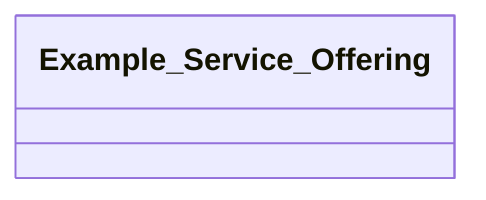

## example Properties

### Class Diagram

### Class Hierarchy

- Example Service Offering (https://w3id.org/gaia-x4plcaad/ontologies/example/v1/ExampleServiceOffering)

### Class Definitions

|Class|IRI|Description|Parents|
|---|---|---|---|
|Example Service Offering|https://w3id.org/gaia-x4plcaad/ontologies/example/v1/ExampleServiceOffering|Describes an example Service Offering.|VirtualResource|

## Prefixes

- example_ontology: <https://w3id.org/gaia-x4plcaad/ontologies/example/v1/>
- openlabel: <https://openlabel.asam.net/V1-0-0/ontologies/>
- owl: <http://www.w3.org/2002/07/owl#>
- rdf: <http://www.w3.org/1999/02/22-rdf-syntax-ns#>
- sh: <http://www.w3.org/ns/shacl#>
- skos: <http://www.w3.org/2004/02/skos/core#>
- xsd: <http://www.w3.org/2001/XMLSchema#>

### SHACL Properties

#### example_ontology:belongsTo {: #prop-https---w3id-org-gaia-x4plcaad-ontologies-example-v1-belongsto .property-anchor }
#### example_ontology:hasJunctionIntersection {: #prop-https---w3id-org-gaia-x4plcaad-ontologies-example-v1-hasjunctionintersection .property-anchor }
#### example_ontology:property1 {: #prop-https---w3id-org-gaia-x4plcaad-ontologies-example-v1-property1 .property-anchor }
#### example_ontology:property2 {: #prop-https---w3id-org-gaia-x4plcaad-ontologies-example-v1-property2 .property-anchor }

|Shape|Property prefix|Property|MinCount|MaxCount|Description|Datatype/NodeKind|Filename|
|---|---|---|---|---|---|---|---|
|ExampleServiceOfferingShape|example_ontology|property1|1||A description that describes property 1.|<http://www.w3.org/2001/XMLSchema#string>|example.shacl.ttl|
|ExampleServiceOfferingShape|example_ontology|property2|1||A description that describes property 2.|<http://www.w3.org/2001/XMLSchema#string>|example.shacl.ttl|
|ExampleServiceOfferingShape|example_ontology|belongsTo|1||Identifier of related Self Description.|<http://www.w3.org/ns/shacl#IRI>|example.shacl.ttl|
|ExampleServiceOfferingShape|example_ontology|hasJunctionIntersection|1|1|Further description of the content of the scenario|<http://www.w3.org/ns/shacl#IRI>|example.shacl.ttl|
