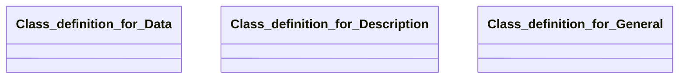

## general Properties

### Class Diagram

### Class Hierarchy

- Class definition for Data (https://w3id.org/gaia-x4plcaad/ontologies/general/v3/Data)
- Class definition for Description (https://w3id.org/gaia-x4plcaad/ontologies/general/v3/Description)
- Class definition for General (https://w3id.org/gaia-x4plcaad/ontologies/general/v3/General)

### Class Definitions

|Class|IRI|Description|Parents|
|---|---|---|---|
|Class definition for Data|https://w3id.org/gaia-x4plcaad/ontologies/general/v3/Data|General data properties of the simulation asset.||
|Class definition for Description|https://w3id.org/gaia-x4plcaad/ontologies/general/v3/Description|General text based description of the simulation asset.||
|Class definition for General|https://w3id.org/gaia-x4plcaad/ontologies/general/v3/General|General properties common for all simulation assets.||

## Prefixes

- general: <https://w3id.org/gaia-x4plcaad/ontologies/general/v3/>
- owl: <http://www.w3.org/2002/07/owl#>
- rdf: <http://www.w3.org/1999/02/22-rdf-syntax-ns#>
- sh: <http://www.w3.org/ns/shacl#>
- skos: <http://www.w3.org/2004/02/skos/core#>
- xsd: <http://www.w3.org/2001/XMLSchema#>

### SHACL Properties

#### general:data {: #prop-https---w3id-org-gaia-x4plcaad-ontologies-general-v3-data .property-anchor }
#### general:description {: #prop-https---w3id-org-gaia-x4plcaad-ontologies-general-v3-description .property-anchor }
#### general:name {: #prop-https---w3id-org-gaia-x4plcaad-ontologies-general-v3-name .property-anchor }
#### general:recordingTime {: #prop-https---w3id-org-gaia-x4plcaad-ontologies-general-v3-recordingtime .property-anchor }
#### general:size {: #prop-https---w3id-org-gaia-x4plcaad-ontologies-general-v3-size .property-anchor }

|Shape|Property prefix|Property|MinCount|MaxCount|Description|Datatype/NodeKind|Filename|
|---|---|---|---|---|---|---|---|
|GeneralShape|general|description|1|1|General text based description of the simulation asset.||general.shacl.ttl|
|GeneralShape|general|data|1|1|Data properties of the simulation asset.||general.shacl.ttl|
|DescriptionShape|general|name|1|1|A human readable name of the entity.|<http://www.w3.org/2001/XMLSchema#string>|general.shacl.ttl|
|DescriptionShape|general|description|1|1|A free text description of the entity.|<http://www.w3.org/2001/XMLSchema#string>|general.shacl.ttl|
|DataShape|general|size|1|1|Size of the data file(s) (e.g. xodr, 3d model zip) to be downloaded in MB (megabyte).|<http://www.w3.org/2001/XMLSchema#float>|general.shacl.ttl|
|DataShape|general|recordingTime||1|Time of data acquisition used to generate the asset, if partial measurement: oldest date|<http://www.w3.org/2001/XMLSchema#dateTime>|general.shacl.ttl|
