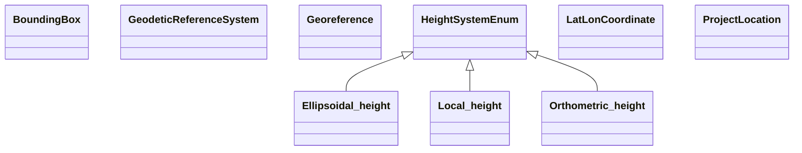

## georeference Properties

### Class Diagram

### Class Hierarchy

- BoundingBox (https://w3id.org/ascs-ev/envited-x/georeference/v6/BoundingBox)
- GeodeticReferenceSystem (https://w3id.org/ascs-ev/envited-x/georeference/v6/GeodeticReferenceSystem)
- Georeference (https://w3id.org/ascs-ev/envited-x/georeference/v6/Georeference)
- HeightSystemEnum (https://w3id.org/ascs-ev/envited-x/georeference/v6/HeightSystemEnum)
  - Ellipsoidal height (https://w3id.org/ascs-ev/envited-x/georeference/v6/HeightSystemEnum#Ellipsoidal%20height)
  - Local height (https://w3id.org/ascs-ev/envited-x/georeference/v6/HeightSystemEnum#Local%20height)
  - Orthometric height (https://w3id.org/ascs-ev/envited-x/georeference/v6/HeightSystemEnum#Orthometric%20height)
- LatLonCoordinate (https://w3id.org/ascs-ev/envited-x/georeference/v6/LatLonCoordinate)
- ProjectLocation (https://w3id.org/ascs-ev/envited-x/georeference/v6/ProjectLocation)

### Class Definitions

|Class|IRI|Description|Parents|
|---|---|---|---|
|BoundingBox|https://w3id.org/ascs-ev/envited-x/georeference/v6/BoundingBox|Bounding box of the asset in world coordinates.||
|Ellipsoidal height|https://w3id.org/ascs-ev/envited-x/georeference/v6/HeightSystemEnum#Ellipsoidal%20height||HeightSystemEnum|
|GeodeticReferenceSystem|https://w3id.org/ascs-ev/envited-x/georeference/v6/GeodeticReferenceSystem|Positions (origin and viewpoint), projection and height system of the asset.||
|Georeference|https://w3id.org/ascs-ev/envited-x/georeference/v6/Georeference|A georeferencing dataset that defines the coordinate system, location, and spatial properties of a simulation asset. This class serves as an optional metadata extension and does not function as a standalone data resource.||
|HeightSystemEnum|https://w3id.org/ascs-ev/envited-x/georeference/v6/HeightSystemEnum|||
|LatLonCoordinate|https://w3id.org/ascs-ev/envited-x/georeference/v6/LatLonCoordinate|A position in world coordinates.||
|Local height|https://w3id.org/ascs-ev/envited-x/georeference/v6/HeightSystemEnum#Local%20height||HeightSystemEnum|
|Orthometric height|https://w3id.org/ascs-ev/envited-x/georeference/v6/HeightSystemEnum#Orthometric%20height||HeightSystemEnum|
|ProjectLocation|https://w3id.org/ascs-ev/envited-x/georeference/v6/ProjectLocation|Describes where the asset is located.||

## Prefixes

- georeference: <https://w3id.org/ascs-ev/envited-x/georeference/v6/>
- rdf: <http://www.w3.org/1999/02/22-rdf-syntax-ns#>
- rdfs: <http://www.w3.org/2000/01/rdf-schema#>
- sh: <http://www.w3.org/ns/shacl#>
- xsd: <http://www.w3.org/2001/XMLSchema#>

### SHACL Properties

#### georeference:city {: #prop-https---w3id-org-ascs-ev-envited-x-georeference-v6-city .property-anchor }
#### georeference:codeEPSG {: #prop-https---w3id-org-ascs-ev-envited-x-georeference-v6-codeepsg .property-anchor }
#### georeference:coordinateSystemName {: #prop-https---w3id-org-ascs-ev-envited-x-georeference-v6-coordinatesystemname .property-anchor }
#### georeference:country {: #prop-https---w3id-org-ascs-ev-envited-x-georeference-v6-country .property-anchor }
#### georeference:hasBoundingBox {: #prop-https---w3id-org-ascs-ev-envited-x-georeference-v6-hasboundingbox .property-anchor }
#### georeference:hasGeodeticReferenceSystem {: #prop-https---w3id-org-ascs-ev-envited-x-georeference-v6-hasgeodeticreferencesystem .property-anchor }
#### georeference:hasOrigin {: #prop-https---w3id-org-ascs-ev-envited-x-georeference-v6-hasorigin .property-anchor }
#### georeference:hasProjectLocation {: #prop-https---w3id-org-ascs-ev-envited-x-georeference-v6-hasprojectlocation .property-anchor }
#### georeference:hasViewPoint {: #prop-https---w3id-org-ascs-ev-envited-x-georeference-v6-hasviewpoint .property-anchor }
#### georeference:heightSystem {: #prop-https---w3id-org-ascs-ev-envited-x-georeference-v6-heightsystem .property-anchor }
#### georeference:lat {: #prop-https---w3id-org-ascs-ev-envited-x-georeference-v6-lat .property-anchor }
#### georeference:lon {: #prop-https---w3id-org-ascs-ev-envited-x-georeference-v6-lon .property-anchor }
#### georeference:region {: #prop-https---w3id-org-ascs-ev-envited-x-georeference-v6-region .property-anchor }
#### georeference:relationOrArea {: #prop-https---w3id-org-ascs-ev-envited-x-georeference-v6-relationorarea .property-anchor }
#### georeference:state {: #prop-https---w3id-org-ascs-ev-envited-x-georeference-v6-state .property-anchor }
#### georeference:xMax {: #prop-https---w3id-org-ascs-ev-envited-x-georeference-v6-xmax .property-anchor }
#### georeference:xMin {: #prop-https---w3id-org-ascs-ev-envited-x-georeference-v6-xmin .property-anchor }
#### georeference:yMax {: #prop-https---w3id-org-ascs-ev-envited-x-georeference-v6-ymax .property-anchor }
#### georeference:yMin {: #prop-https---w3id-org-ascs-ev-envited-x-georeference-v6-ymin .property-anchor }

|Shape|Property prefix|Property|MinCount|MaxCount|Description|Datatype/NodeKind|Filename|
|---|---|---|---|---|---|---|---|
|BoundingBoxShape|georeference|yMax|1|1|Defines the maximum bounding box value along the y-axis.|<http://www.w3.org/2001/XMLSchema#float>|georeference.shacl.ttl|
|BoundingBoxShape|georeference|yMin|1|1|Defines the minimum bounding box value along the y-axis.|<http://www.w3.org/2001/XMLSchema#float>|georeference.shacl.ttl|
|BoundingBoxShape|georeference|xMin|1|1|Defines the minimum bounding box value along the x-axis.|<http://www.w3.org/2001/XMLSchema#float>|georeference.shacl.ttl|
|BoundingBoxShape|georeference|xMax|1|1|Defines the maximum bounding box value along the x-axis.|<http://www.w3.org/2001/XMLSchema#float>|georeference.shacl.ttl|
|GeodeticReferenceSystemShape|georeference|codeEPSG||1|Defines the projection EPSG code for the asset.|<http://www.w3.org/2001/XMLSchema#integer>|georeference.shacl.ttl|
|GeodeticReferenceSystemShape|georeference|hasViewPoint||1|Defines the imported viewpoint position of the asset in world coordinates.|<http://www.w3.org/ns/shacl#BlankNodeOrIRI>|georeference.shacl.ttl|
|GeodeticReferenceSystemShape|georeference|hasOrigin|1|1|Defines the center position of the asset in world coordinates.|<http://www.w3.org/ns/shacl#BlankNodeOrIRI>|georeference.shacl.ttl|
|GeodeticReferenceSystemShape|georeference|coordinateSystemName||1|Describes the coordinate system name of the asset as an alternative to the EPSG code.|<http://www.w3.org/2001/XMLSchema#string>|georeference.shacl.ttl|
|GeodeticReferenceSystemShape|georeference|heightSystem||1|Defines the height system type of the asset.||georeference.shacl.ttl|
|GeoreferenceShape|georeference|hasGeodeticReferenceSystem|1|1|Properties for positions (e.g., origin and viewpoint), projection type and height system of the asset.|<http://www.w3.org/ns/shacl#BlankNodeOrIRI>|georeference.shacl.ttl|
|GeoreferenceShape|georeference|hasProjectLocation|1|1|Contains properties (state, city, region, country, bounding) to describe the location of the asset.|<http://www.w3.org/ns/shacl#BlankNodeOrIRI>|georeference.shacl.ttl|
|LatLonCoordinateShape|georeference|lon|1|1|Defines a world longitude value (on the x-axis) in degrees.|<http://www.w3.org/2001/XMLSchema#float>|georeference.shacl.ttl|
|LatLonCoordinateShape|georeference|lat|1|1|Defines a world latitude value (on the y-axis) in degrees.|<http://www.w3.org/2001/XMLSchema#float>|georeference.shacl.ttl|
|ProjectLocationShape|georeference|hasBoundingBox|1|1|Defines the bounding box in world coordinates of the asset.|<http://www.w3.org/ns/shacl#BlankNodeOrIRI>|georeference.shacl.ttl|
|ProjectLocationShape|georeference|relationOrArea||1|Describes the area in which the asset is located, such as the name of the main street or the greater area.|<http://www.w3.org/2001/XMLSchema#string>|georeference.shacl.ttl|
|ProjectLocationShape|georeference|city||1|Specifies the name of the city in which the asset's centre is located.|<http://www.w3.org/2001/XMLSchema#string>|georeference.shacl.ttl|
|ProjectLocationShape|georeference|region||1|Specifies the name of the region in which the asset's centre is located.|<http://www.w3.org/2001/XMLSchema#string>|georeference.shacl.ttl|
|ProjectLocationShape|georeference|state||1|Defines an ISO 3166-2 code for the state or province in which the asset centre is located.|<http://www.w3.org/2001/XMLSchema#string>|georeference.shacl.ttl|
|ProjectLocationShape|georeference|country||1|Defines an ISO 3166-1, alpha-2 code for the country in which the asset centre is located.|<http://www.w3.org/2001/XMLSchema#string>|georeference.shacl.ttl|
