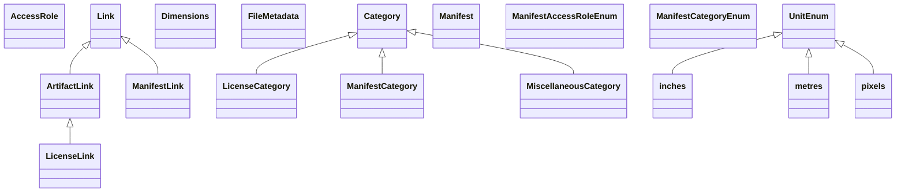

## manifest Properties

### Class Diagram

### Class Hierarchy

- AccessRole (https://w3id.org/ascs-ev/envited-x/manifest/v6/AccessRole)
- Category (https://w3id.org/ascs-ev/envited-x/manifest/v6/Category)
  - LicenseCategory (https://w3id.org/ascs-ev/envited-x/manifest/v6/LicenseCategory)
  - ManifestCategory (https://w3id.org/ascs-ev/envited-x/manifest/v6/ManifestCategory)
  - MiscellaneousCategory (https://w3id.org/ascs-ev/envited-x/manifest/v6/MiscellaneousCategory)
- Dimensions (https://w3id.org/ascs-ev/envited-x/manifest/v6/Dimensions)
- FileMetadata (https://w3id.org/ascs-ev/envited-x/manifest/v6/FileMetadata)
- Link (https://w3id.org/ascs-ev/envited-x/manifest/v6/Link)
  - ArtifactLink (https://w3id.org/ascs-ev/envited-x/manifest/v6/ArtifactLink)
    - LicenseLink (https://w3id.org/ascs-ev/envited-x/manifest/v6/LicenseLink)
  - ManifestLink (https://w3id.org/ascs-ev/envited-x/manifest/v6/ManifestLink)
- Manifest (https://w3id.org/ascs-ev/envited-x/manifest/v6/Manifest)
- ManifestAccessRoleEnum (https://w3id.org/ascs-ev/envited-x/manifest/v6/ManifestAccessRoleEnum)
- ManifestCategoryEnum (https://w3id.org/ascs-ev/envited-x/manifest/v6/ManifestCategoryEnum)
- UnitEnum (https://w3id.org/ascs-ev/envited-x/manifest/v6/UnitEnum)
  - inches (https://w3id.org/ascs-ev/envited-x/manifest/v6/UnitEnum#inches)
  - metres (https://w3id.org/ascs-ev/envited-x/manifest/v6/UnitEnum#metres)
  - pixels (https://w3id.org/ascs-ev/envited-x/manifest/v6/UnitEnum#pixels)

### Class Definitions

|Class|IRI|Description|Parents|
|---|---|---|---|
|AccessRole|https://w3id.org/ascs-ev/envited-x/manifest/v6/AccessRole|A class representing different access roles of artifacts in a manifest.||
|ArtifactLink|https://w3id.org/ascs-ev/envited-x/manifest/v6/ArtifactLink|A Link to an artifact of a manifest: its content, license or a referenced artifact.|Link|
|Category|https://w3id.org/ascs-ev/envited-x/manifest/v6/Category|A class representing different categories of artifacts in a manifest.||
|Dimensions|https://w3id.org/ascs-ev/envited-x/manifest/v6/Dimensions|General class for defining the dimensions of a data file, e.g., of type image or video, referenced inside a manifest:FileMetadata.||
|FileMetadata|https://w3id.org/ascs-ev/envited-x/manifest/v6/FileMetadata|Represents the properties of a data file referenced within a Link instance.||
|inches|https://w3id.org/ascs-ev/envited-x/manifest/v6/UnitEnum#inches||UnitEnum|
|LicenseCategory|https://w3id.org/ascs-ev/envited-x/manifest/v6/LicenseCategory||Category|
|LicenseLink|https://w3id.org/ascs-ev/envited-x/manifest/v6/LicenseLink|A Link used for the license of a manifest.|ArtifactLink|
|Link|https://w3id.org/ascs-ev/envited-x/manifest/v6/Link|Defines a Link instance that connects to data and mandatory metadata within an asset or related published simulation assets; can include web references.||
|Manifest|https://w3id.org/ascs-ev/envited-x/manifest/v6/Manifest|Defines the structure of an asset (e.g. simulation asset) as list of contents using a manifest.json, listing explicitely included artifacts, referenced artifacts and license information as linked properties. Typically used for archives.||
|ManifestAccessRoleEnum|https://w3id.org/ascs-ev/envited-x/manifest/v6/ManifestAccessRoleEnum|The access roles manifest defines.||
|ManifestCategory|https://w3id.org/ascs-ev/envited-x/manifest/v6/ManifestCategory||Category|
|ManifestCategoryEnum|https://w3id.org/ascs-ev/envited-x/manifest/v6/ManifestCategoryEnum|The artifact categories manifest defines.||
|ManifestLink|https://w3id.org/ascs-ev/envited-x/manifest/v6/ManifestLink|A Link used for the self-reference of a manifest.|Link|
|metres|https://w3id.org/ascs-ev/envited-x/manifest/v6/UnitEnum#metres||UnitEnum|
|MiscellaneousCategory|https://w3id.org/ascs-ev/envited-x/manifest/v6/MiscellaneousCategory||Category|
|pixels|https://w3id.org/ascs-ev/envited-x/manifest/v6/UnitEnum#pixels||UnitEnum|
|UnitEnum|https://w3id.org/ascs-ev/envited-x/manifest/v6/UnitEnum|||

## Prefixes

- manifest: <https://w3id.org/ascs-ev/envited-x/manifest/v6/>
- rdf: <http://www.w3.org/1999/02/22-rdf-syntax-ns#>
- rdfs: <http://www.w3.org/2000/01/rdf-schema#>
- sh: <http://www.w3.org/ns/shacl#>
- skos: <http://www.w3.org/2004/02/skos/core#>
- xsd: <http://www.w3.org/2001/XMLSchema#>

### SHACL Properties

#### manifest:cid {: #prop-https---w3id-org-ascs-ev-envited-x-manifest-v6-cid .property-anchor }
#### manifest:depth {: #prop-https---w3id-org-ascs-ev-envited-x-manifest-v6-depth .property-anchor }
#### manifest:filename {: #prop-https---w3id-org-ascs-ev-envited-x-manifest-v6-filename .property-anchor }
#### manifest:filePath {: #prop-https---w3id-org-ascs-ev-envited-x-manifest-v6-filepath .property-anchor }
#### manifest:fileSize {: #prop-https---w3id-org-ascs-ev-envited-x-manifest-v6-filesize .property-anchor }
#### manifest:hasAccessRole {: #prop-https---w3id-org-ascs-ev-envited-x-manifest-v6-hasaccessrole .property-anchor }
#### manifest:hasArtifacts {: #prop-https---w3id-org-ascs-ev-envited-x-manifest-v6-hasartifacts .property-anchor }
#### manifest:hasCategory {: #prop-https---w3id-org-ascs-ev-envited-x-manifest-v6-hascategory .property-anchor }
#### manifest:hasDimensions {: #prop-https---w3id-org-ascs-ev-envited-x-manifest-v6-hasdimensions .property-anchor }
#### manifest:hasFileMetadata {: #prop-https---w3id-org-ascs-ev-envited-x-manifest-v6-hasfilemetadata .property-anchor }
#### manifest:hasLicense {: #prop-https---w3id-org-ascs-ev-envited-x-manifest-v6-haslicense .property-anchor }
#### manifest:hasManifestReference {: #prop-https---w3id-org-ascs-ev-envited-x-manifest-v6-hasmanifestreference .property-anchor }
#### manifest:hasReferencedArtifacts {: #prop-https---w3id-org-ascs-ev-envited-x-manifest-v6-hasreferencedartifacts .property-anchor }
#### manifest:height {: #prop-https---w3id-org-ascs-ev-envited-x-manifest-v6-height .property-anchor }
#### manifest:id {: #prop-https---w3id-org-ascs-ev-envited-x-manifest-v6-id .property-anchor }
#### manifest:iri {: #prop-https---w3id-org-ascs-ev-envited-x-manifest-v6-iri .property-anchor }
#### manifest:mimeType {: #prop-https---w3id-org-ascs-ev-envited-x-manifest-v6-mimetype .property-anchor }
#### manifest:timestamp {: #prop-https---w3id-org-ascs-ev-envited-x-manifest-v6-timestamp .property-anchor }
#### manifest:unit {: #prop-https---w3id-org-ascs-ev-envited-x-manifest-v6-unit .property-anchor }
#### manifest:width {: #prop-https---w3id-org-ascs-ev-envited-x-manifest-v6-width .property-anchor }
#### sh:conformsTo {: #prop-http---www-w3-org-ns-shacl-conformsto .property-anchor }
#### skos:note {: #prop-http---www-w3-org-2004-02-skos-core-note .property-anchor }

|Shape|Property prefix|Property|MinCount|MaxCount|Description|Datatype/NodeKind|Filename|
|---|---|---|---|---|---|---|---|
|AccessRoleShape|manifest|id||1|The IRI of a named individual.|<http://www.w3.org/ns/shacl#IRI>|manifest.shacl.ttl|
|ArtifactLinkShape|skos|note||1|Additional information about the linked artifact.|<http://www.w3.org/2001/XMLSchema#string>|manifest.shacl.ttl|
|ArtifactLinkShape|manifest|hasAccessRole|1|1|General property to indicate the access role of an artifact.|<http://www.w3.org/ns/shacl#IRI>|manifest.shacl.ttl|
|ArtifactLinkShape|manifest|hasFileMetadata|1|1|Associates a FileMetadata instance with its corresponding Link; only applicable within Link instances.|<http://www.w3.org/ns/shacl#BlankNodeOrIRI>|manifest.shacl.ttl|
|ArtifactLinkShape|manifest|hasCategory|1|1|General property to indicate the category of an artifact.|<http://www.w3.org/ns/shacl#IRI>|manifest.shacl.ttl|
|ArtifactLinkShape|manifest|iri||1|IRI required if the file is RDF/JSON-LD.|<http://www.w3.org/ns/shacl#IRI>|manifest.shacl.ttl|
|ArtifactLinkShape|sh|conformsTo|||Specifies ontology conformance.|<http://www.w3.org/ns/shacl#IRI>|manifest.shacl.ttl|
|CategoryShape|manifest|id||1|The IRI of a named individual.|<http://www.w3.org/ns/shacl#IRI>|manifest.shacl.ttl|
|DimensionsShape|manifest|height|1|1|Specifies the height (y-axis) of the item in appropriate units.|<http://www.w3.org/2001/XMLSchema#float>|manifest.shacl.ttl|
|DimensionsShape|manifest|depth||1|Specifies the depth (z-axis) of the item in appropriate units.|<http://www.w3.org/2001/XMLSchema#float>|manifest.shacl.ttl|
|DimensionsShape|manifest|width|1|1|Specifies the width (x-axis) of the item in appropriate units.|<http://www.w3.org/2001/XMLSchema#float>|manifest.shacl.ttl|
|DimensionsShape|manifest|unit|1|1|Specifies the unit of measurement (e.g., metres, inches).||manifest.shacl.ttl|
|FileMetadataShape|manifest|hasDimensions||1|Links a Dimensions instance to its associated FileMetadata, defining the size and scale of the data file; applicable only within FileMetadata instances.|<http://www.w3.org/ns/shacl#BlankNodeOrIRI>|manifest.shacl.ttl|
|FileMetadataShape|manifest|timestamp||1|Represents a date or time associated with the file, such as recording time or creation time.|<http://www.w3.org/2001/XMLSchema#dateTime>|manifest.shacl.ttl|
|FileMetadataShape|manifest|cid||1|Defines the IPFS CIDv1 identifier of the file.|<http://www.w3.org/2001/XMLSchema#string>|manifest.shacl.ttl|
|FileMetadataShape|manifest|filePath|1|1|A local or remote path/URL from which the file can be retrieved (e.g. './manifest_reference.json', 'ipfs://...', 's3://...', 'https://...').|<http://www.w3.org/2001/XMLSchema#anyURI>|manifest.shacl.ttl|
|FileMetadataShape|manifest|filename||1|Specifies the file name (excluding the path) along with its extension.|<http://www.w3.org/2001/XMLSchema#string>|manifest.shacl.ttl|
|FileMetadataShape|manifest|fileSize||1|Specifies the file size in bytes.|<http://www.w3.org/2001/XMLSchema#integer>|manifest.shacl.ttl|
|FileMetadataShape|manifest|mimeType|1|1|Defines the MIME type of the file.|<http://www.w3.org/2001/XMLSchema#string>|manifest.shacl.ttl|
|LicenseCategoryShape|manifest|id||1|The IRI of a named individual.|<http://www.w3.org/ns/shacl#IRI>|manifest.shacl.ttl|
|LicenseLinkShape|sh|conformsTo|||Specifies ontology conformance.|<http://www.w3.org/ns/shacl#IRI>|manifest.shacl.ttl|
|LicenseLinkShape|manifest|hasFileMetadata|1|1|Associates a FileMetadata instance with its corresponding Link; only applicable within Link instances.|<http://www.w3.org/ns/shacl#BlankNodeOrIRI>|manifest.shacl.ttl|
|LicenseLinkShape|manifest|hasAccessRole|1|1|General property to indicate the access role of an artifact.|<http://www.w3.org/ns/shacl#IRI>|manifest.shacl.ttl|
|LicenseLinkShape|skos|note||1|Additional information about the linked artifact.|<http://www.w3.org/2001/XMLSchema#string>|manifest.shacl.ttl|
|LicenseLinkShape|manifest|iri||1|IRI required if the file is RDF/JSON-LD.|<http://www.w3.org/ns/shacl#IRI>|manifest.shacl.ttl|
|LicenseLinkShape|manifest|hasCategory|1|1|General property to indicate the category of an artifact.|<http://www.w3.org/ns/shacl#IRI>|manifest.shacl.ttl|
|LinkShape|skos|note||1|Additional information about the linked artifact.|<http://www.w3.org/2001/XMLSchema#string>|manifest.shacl.ttl|
|LinkShape|manifest|hasFileMetadata|1|1|Associates a FileMetadata instance with its corresponding Link; only applicable within Link instances.|<http://www.w3.org/ns/shacl#BlankNodeOrIRI>|manifest.shacl.ttl|
|LinkShape|manifest|hasCategory|1|1|General property to indicate the category of an artifact.|<http://www.w3.org/ns/shacl#IRI>|manifest.shacl.ttl|
|LinkShape|manifest|hasAccessRole|1|1|General property to indicate the access role of an artifact.|<http://www.w3.org/ns/shacl#IRI>|manifest.shacl.ttl|
|LinkShape|sh|conformsTo|||Specifies ontology conformance.|<http://www.w3.org/ns/shacl#IRI>|manifest.shacl.ttl|
|LinkShape|manifest|iri||1|IRI required if the file is RDF/JSON-LD.|<http://www.w3.org/ns/shacl#IRI>|manifest.shacl.ttl|
|ManifestCategoryShape|manifest|id||1|The IRI of a named individual.|<http://www.w3.org/ns/shacl#IRI>|manifest.shacl.ttl|
|ManifestLinkShape|sh|conformsTo|||Specifies ontology conformance.|<http://www.w3.org/ns/shacl#IRI>|manifest.shacl.ttl|
|ManifestLinkShape|skos|note||1|Additional information about the linked artifact.|<http://www.w3.org/2001/XMLSchema#string>|manifest.shacl.ttl|
|ManifestLinkShape|manifest|hasCategory|1|1|General property to indicate the category of an artifact.|<http://www.w3.org/ns/shacl#IRI>|manifest.shacl.ttl|
|ManifestLinkShape|manifest|hasFileMetadata|1|1|Associates a FileMetadata instance with its corresponding Link; only applicable within Link instances.|<http://www.w3.org/ns/shacl#BlankNodeOrIRI>|manifest.shacl.ttl|
|ManifestLinkShape|manifest|hasAccessRole|1|1|General property to indicate the access role of an artifact.|<http://www.w3.org/ns/shacl#IRI>|manifest.shacl.ttl|
|ManifestLinkShape|manifest|iri||1|IRI required if the file is RDF/JSON-LD.|<http://www.w3.org/ns/shacl#IRI>|manifest.shacl.ttl|
|ManifestShape|manifest|hasLicense|1|1|Associates a Manifest instance with its corresponding license; only applicable within Manifest instances.|<http://www.w3.org/ns/shacl#BlankNodeOrIRI>|manifest.shacl.ttl|
|ManifestShape|manifest|hasReferencedArtifacts|||Associates a Manifest instance with its referenced artifacts, represented as Link instances; only applicable within Manifest instances.|<http://www.w3.org/ns/shacl#BlankNodeOrIRI>|manifest.shacl.ttl|
|ManifestShape|manifest|hasArtifacts|1||Associates a Manifest instance with its artifacts, represented as Link instances; only applicable within Manifest instances.|<http://www.w3.org/ns/shacl#BlankNodeOrIRI>|manifest.shacl.ttl|
|ManifestShape|manifest|hasManifestReference|1|1|Links a Manifest to its corresponding manifest reference file, defining the structure and contents of a digital asset; only applicable within Manifest instances.|<http://www.w3.org/ns/shacl#BlankNodeOrIRI>|manifest.shacl.ttl|
|MiscellaneousCategoryShape|manifest|id||1|The IRI of a named individual.|<http://www.w3.org/ns/shacl#IRI>|manifest.shacl.ttl|
