## ositrace Properties

### Class Diagram

```mermaid
classDiagram
class Class_definition_for_Channel
class Class_definition_for_Content
class Class_definition_for_DataSource
class Class_definition_for_DomainSpecification
class Class_definition_for_Event
class Class_definition_for_Format
class Class_definition_for_MovingObject
class Class_definition_for_OSITrace
class Class_definition_for_Quality
class Class_definition_for_Quantity
```

### Class Hierarchy

- Class definition for Channel (https://w3id.org/ascs-ev/envited-x/ositrace/v6/Channel)
- Class definition for Content (https://w3id.org/ascs-ev/envited-x/ositrace/v6/Content)
- Class definition for DataSource (https://w3id.org/ascs-ev/envited-x/ositrace/v6/DataSource)
- Class definition for DomainSpecification (https://w3id.org/ascs-ev/envited-x/ositrace/v6/DomainSpecification)
- Class definition for Event (https://w3id.org/ascs-ev/envited-x/ositrace/v6/Event)
- Class definition for Format (https://w3id.org/ascs-ev/envited-x/ositrace/v6/Format)
- Class definition for MovingObject (https://w3id.org/ascs-ev/envited-x/ositrace/v6/MovingObject)
- Class definition for OSITrace (https://w3id.org/ascs-ev/envited-x/ositrace/v6/OSITrace)
- Class definition for Quality (https://w3id.org/ascs-ev/envited-x/ositrace/v6/Quality)
- Class definition for Quantity (https://w3id.org/ascs-ev/envited-x/ositrace/v6/Quantity)

### Class Definitions

|Class|IRI|Description|Parents|
|---|---|---|---|
|Class definition for Channel|https://w3id.org/ascs-ev/envited-x/ositrace/v6/Channel|Represents a single channel in an MCAP container file. Each channel carries messages of one OSI top-level type at a specific OSI schema version. Linked from ositrace:Format via ositrace:hasChannel.||
|Class definition for Content|https://w3id.org/ascs-ev/envited-x/ositrace/v6/Content|Attributes for the content of ASAM OSI trace files.|Content|
|Class definition for DataSource|https://w3id.org/ascs-ev/envited-x/ositrace/v6/DataSource|Attributes for the data source of ASAM OSI trace files.|DataSource|
|Class definition for DomainSpecification|https://w3id.org/ascs-ev/envited-x/ositrace/v6/DomainSpecification|OSI trace DomainSpecification containing additional metadata information of the simulation asset.|DomainSpecification|
|Class definition for Event|https://w3id.org/ascs-ev/envited-x/ositrace/v6/Event|Attributes for event in  ASAM OSI trace files.||
|Class definition for Format|https://w3id.org/ascs-ev/envited-x/ositrace/v6/Format|Attributes for the format of ASAM OSI trace files, covering both single-channel .osi files and multi-channel MCAP containers.|Format|
|Class definition for MovingObject|https://w3id.org/ascs-ev/envited-x/ositrace/v6/MovingObject|Attributes for moving objects in ASAM OSI trace files.||
|Class definition for OSITrace|https://w3id.org/ascs-ev/envited-x/ositrace/v6/OSITrace|Attributes for ASAM OSI trace files.|SimulationAsset|
|Class definition for Quality|https://w3id.org/ascs-ev/envited-x/ositrace/v6/Quality|Attributes for the quality of ASAM OSI trace files.|Quality|
|Class definition for Quantity|https://w3id.org/ascs-ev/envited-x/ositrace/v6/Quantity|Attributes for the quantity of ASAM OSI trace files.|Quantity|

## Prefixes

- brick: <https://brickschema.org/schema/Brick#>
- csvw: <http://www.w3.org/ns/csvw#>
- dc: <http://purl.org/dc/elements/1.1/>
- dcam: <http://purl.org/dc/dcam/>
- dcat: <http://www.w3.org/ns/dcat#>
- dcmitype: <http://purl.org/dc/dcmitype/>
- dcterms: <http://purl.org/dc/terms/>
- doap: <http://usefulinc.com/ns/doap#>
- envited-x: <https://w3id.org/ascs-ev/envited-x/envited-x/v3/>
- foaf: <http://xmlns.com/foaf/0.1/>
- geo: <http://www.opengis.net/ont/geosparql#>
- georeference: <https://w3id.org/ascs-ev/envited-x/georeference/v5/>
- manifest: <https://w3id.org/ascs-ev/envited-x/manifest/v5/>
- odrl: <http://www.w3.org/ns/odrl/2/>
- org: <http://www.w3.org/ns/org#>
- ositrace: <https://w3id.org/ascs-ev/envited-x/ositrace/v6/>
- owl: <http://www.w3.org/2002/07/owl#>
- prof: <http://www.w3.org/ns/dx/prof/>
- prov: <http://www.w3.org/ns/prov#>
- qb: <http://purl.org/linked-data/cube#>
- rdf: <http://www.w3.org/1999/02/22-rdf-syntax-ns#>
- rdfs: <http://www.w3.org/2000/01/rdf-schema#>
- schema: <https://schema.org/>
- sh: <http://www.w3.org/ns/shacl#>
- skos: <http://www.w3.org/2004/02/skos/core#>
- sosa: <http://www.w3.org/ns/sosa/>
- ssn: <http://www.w3.org/ns/ssn/>
- time: <http://www.w3.org/2006/time#>
- vann: <http://purl.org/vocab/vann/>
- void: <http://rdfs.org/ns/void#>
- wgs: <https://www.w3.org/2003/01/geo/wgs84_pos#>
- xml: <http://www.w3.org/XML/1998/namespace>
- xsd: <http://www.w3.org/2001/XMLSchema#>

### SHACL Properties

#### ositrace:accuracyLaneModel2d {: #prop-https---w3id-org-ascs-ev-envited-x-ositrace-v6-accuracylanemodel2d .property-anchor }
#### ositrace:accuracyLaneModelHeight {: #prop-https---w3id-org-ascs-ev-envited-x-ositrace-v6-accuracylanemodelheight .property-anchor }
#### ositrace:accuracyObjects {: #prop-https---w3id-org-ascs-ev-envited-x-ositrace-v6-accuracyobjects .property-anchor }
#### ositrace:accuracySignals {: #prop-https---w3id-org-ascs-ev-envited-x-ositrace-v6-accuracysignals .property-anchor }
#### ositrace:calibration {: #prop-https---w3id-org-ascs-ev-envited-x-ositrace-v6-calibration .property-anchor }
#### ositrace:compression {: #prop-https---w3id-org-ascs-ev-envited-x-ositrace-v6-compression .property-anchor }
#### ositrace:description {: #prop-https---w3id-org-ascs-ev-envited-x-ositrace-v6-description .property-anchor }
#### ositrace:fileFormat {: #prop-https---w3id-org-ascs-ev-envited-x-ositrace-v6-fileformat .property-anchor }
#### ositrace:formatType {: #prop-https---w3id-org-ascs-ev-envited-x-ositrace-v6-formattype .property-anchor }
#### ositrace:granularity {: #prop-https---w3id-org-ascs-ev-envited-x-ositrace-v6-granularity .property-anchor }
#### ositrace:hasChannel {: #prop-https---w3id-org-ascs-ev-envited-x-ositrace-v6-haschannel .property-anchor }
#### ositrace:hasContent {: #prop-https---w3id-org-ascs-ev-envited-x-ositrace-v6-hascontent .property-anchor }
#### ositrace:hasDataSource {: #prop-https---w3id-org-ascs-ev-envited-x-ositrace-v6-hasdatasource .property-anchor }
#### ositrace:hasDomainSpecification {: #prop-https---w3id-org-ascs-ev-envited-x-ositrace-v6-hasdomainspecification .property-anchor }
#### ositrace:hasEvent {: #prop-https---w3id-org-ascs-ev-envited-x-ositrace-v6-hasevent .property-anchor }
#### ositrace:hasFormat {: #prop-https---w3id-org-ascs-ev-envited-x-ositrace-v6-hasformat .property-anchor }
#### ositrace:hasGeoreference {: #prop-https---w3id-org-ascs-ev-envited-x-ositrace-v6-hasgeoreference .property-anchor }
#### ositrace:hasHostMovingObject {: #prop-https---w3id-org-ascs-ev-envited-x-ositrace-v6-hashostmovingobject .property-anchor }
#### ositrace:hasManifest {: #prop-https---w3id-org-ascs-ev-envited-x-ositrace-v6-hasmanifest .property-anchor }
#### ositrace:hasQuality {: #prop-https---w3id-org-ascs-ev-envited-x-ositrace-v6-hasquality .property-anchor }
#### ositrace:hasQuantity {: #prop-https---w3id-org-ascs-ev-envited-x-ositrace-v6-hasquantity .property-anchor }
#### ositrace:hasResourceDescription {: #prop-https---w3id-org-ascs-ev-envited-x-ositrace-v6-hasresourcedescription .property-anchor }
#### ositrace:hasTargetMovingObject {: #prop-https---w3id-org-ascs-ev-envited-x-ositrace-v6-hastargetmovingobject .property-anchor }
#### ositrace:identifier {: #prop-https---w3id-org-ascs-ev-envited-x-ositrace-v6-identifier .property-anchor }
#### ositrace:laneTypes {: #prop-https---w3id-org-ascs-ev-envited-x-ositrace-v6-lanetypes .property-anchor }
#### ositrace:levelOfDetail {: #prop-https---w3id-org-ascs-ev-envited-x-ositrace-v6-levelofdetail .property-anchor }
#### ositrace:maxOsiVersion {: #prop-https---w3id-org-ascs-ev-envited-x-ositrace-v6-maxosiversion .property-anchor }
#### ositrace:maxProtobufVersion {: #prop-https---w3id-org-ascs-ev-envited-x-ositrace-v6-maxprotobufversion .property-anchor }
#### ositrace:measurementSystem {: #prop-https---w3id-org-ascs-ev-envited-x-ositrace-v6-measurementsystem .property-anchor }
#### ositrace:messageType {: #prop-https---w3id-org-ascs-ev-envited-x-ositrace-v6-messagetype .property-anchor }
#### ositrace:minOsiVersion {: #prop-https---w3id-org-ascs-ev-envited-x-ositrace-v6-minosiversion .property-anchor }
#### ositrace:minProtobufVersion {: #prop-https---w3id-org-ascs-ev-envited-x-ositrace-v6-minprotobufversion .property-anchor }
#### ositrace:numberFrames {: #prop-https---w3id-org-ascs-ev-envited-x-ositrace-v6-numberframes .property-anchor }
#### ositrace:numberOfChannels {: #prop-https---w3id-org-ascs-ev-envited-x-ositrace-v6-numberofchannels .property-anchor }
#### ositrace:numberOfMessages {: #prop-https---w3id-org-ascs-ev-envited-x-ositrace-v6-numberofmessages .property-anchor }
#### ositrace:osiTraceFormatVersion {: #prop-https---w3id-org-ascs-ev-envited-x-ositrace-v6-ositraceformatversion .property-anchor }
#### ositrace:osiVersion {: #prop-https---w3id-org-ascs-ev-envited-x-ositrace-v6-osiversion .property-anchor }
#### ositrace:precision {: #prop-https---w3id-org-ascs-ev-envited-x-ositrace-v6-precision .property-anchor }
#### ositrace:protobufVersion {: #prop-https---w3id-org-ascs-ev-envited-x-ositrace-v6-protobufversion .property-anchor }
#### ositrace:roadTypes {: #prop-https---w3id-org-ascs-ev-envited-x-ositrace-v6-roadtypes .property-anchor }
#### ositrace:scenarioIdentifier {: #prop-https---w3id-org-ascs-ev-envited-x-ositrace-v6-scenarioidentifier .property-anchor }
#### ositrace:startTime {: #prop-https---w3id-org-ascs-ev-envited-x-ositrace-v6-starttime .property-anchor }
#### ositrace:stopTime {: #prop-https---w3id-org-ascs-ev-envited-x-ositrace-v6-stoptime .property-anchor }
#### ositrace:tag {: #prop-https---w3id-org-ascs-ev-envited-x-ositrace-v6-tag .property-anchor }
#### ositrace:time {: #prop-https---w3id-org-ascs-ev-envited-x-ositrace-v6-time .property-anchor }
#### ositrace:topic {: #prop-https---w3id-org-ascs-ev-envited-x-ositrace-v6-topic .property-anchor }
#### ositrace:trafficDirection {: #prop-https---w3id-org-ascs-ev-envited-x-ositrace-v6-trafficdirection .property-anchor }
#### ositrace:usedDataSources {: #prop-https---w3id-org-ascs-ev-envited-x-ositrace-v6-useddatasources .property-anchor }
#### ositrace:validationReport {: #prop-https---w3id-org-ascs-ev-envited-x-ositrace-v6-validationreport .property-anchor }
#### ositrace:validationReportType {: #prop-https---w3id-org-ascs-ev-envited-x-ositrace-v6-validationreporttype .property-anchor }
#### ositrace:version {: #prop-https---w3id-org-ascs-ev-envited-x-ositrace-v6-version .property-anchor }
#### ositrace:zeroTime {: #prop-https---w3id-org-ascs-ev-envited-x-ositrace-v6-zerotime .property-anchor }

|Shape|Property prefix|Property|MinCount|MaxCount|Description|Datatype/NodeKind|Filename|
|---|---|---|---|---|---|---|---|
|OSITraceShape|ositrace|hasResourceDescription|1|1|||ositrace.shacl.ttl|
|OSITraceShape|ositrace|hasDomainSpecification|1|1|||ositrace.shacl.ttl|
|OSITraceShape|ositrace|hasManifest|1|1|||ositrace.shacl.ttl|
|DomainSpecificationShape|ositrace|hasContent|1|1|Attributes describing the content of the OSI trace.||ositrace.shacl.ttl|
|DomainSpecificationShape|ositrace|hasFormat|1|1|File format details of the OSI trace.||ositrace.shacl.ttl|
|DomainSpecificationShape|ositrace|hasQuality|1|1|Quality metrics of the OSI trace.||ositrace.shacl.ttl|
|DomainSpecificationShape|ositrace|hasQuantity|1|1|Quantitative metrics describing the OSI trace.||ositrace.shacl.ttl|
|DomainSpecificationShape|ositrace|hasDataSource|1|1|Data sources used to create the OSI trace.||ositrace.shacl.ttl|
|DomainSpecificationShape|ositrace|hasGeoreference||1|Georeferencing information for the OSI trace.||ositrace.shacl.ttl|
|ContentShape|ositrace|roadTypes|||Covered/used road types, defined over ODR element t_road_type, see ODR spec section 8.3||ositrace.shacl.ttl|
|ContentShape|ositrace|laneTypes|||Covered lane types, see ODR spec section 9.5.3.||ositrace.shacl.ttl|
|ContentShape|ositrace|levelOfDetail|||Covered object classes, see ODR spec section 11||ositrace.shacl.ttl|
|ContentShape|ositrace|trafficDirection||1|Traffic direction, i.e. right-hand or left-hand traffic||ositrace.shacl.ttl|
|ContentShape|ositrace|granularity|1||Level of granularity of sensor data||ositrace.shacl.ttl|
|ContentShape|ositrace|scenarioIdentifier|||Identifier of scenario performed in the trace file|<http://www.w3.org/2001/XMLSchema#string>|ositrace.shacl.ttl|
|ContentShape|ositrace|startTime|1|1|Exact start timestamp of the recorded trace|<http://www.w3.org/2001/XMLSchema#dateTime>|ositrace.shacl.ttl|
|ContentShape|ositrace|stopTime|1|1|Exact stop timestamp of the recorded trace|<http://www.w3.org/2001/XMLSchema#dateTime>|ositrace.shacl.ttl|
|ContentShape|ositrace|hasHostMovingObject|1|1|Host moving object in trace file||ositrace.shacl.ttl|
|ContentShape|ositrace|hasTargetMovingObject|||Target moving object(s) in trace file||ositrace.shacl.ttl|
|ContentShape|ositrace|hasEvent|0||Description of events of interest in trace file||ositrace.shacl.ttl|
|DataSourceShape|ositrace|measurementSystem||1|Main acquisition device|<http://www.w3.org/2001/XMLSchema#string>|ositrace.shacl.ttl|
|DataSourceShape|ositrace|usedDataSources|||Basic data for the creation of the trace.|<http://www.w3.org/2001/XMLSchema#string>|ositrace.shacl.ttl|
|SingleChannelFormatShape|ositrace|formatType|1|1|Format type definition for single-channel .osi files.||ositrace.shacl.ttl|
|SingleChannelFormatShape|ositrace|version|1|1|Version of data format (OSI version / protobuf version).|<http://www.w3.org/2001/XMLSchema#string>|ositrace.shacl.ttl|
|MultiChannelFormatShape|ositrace|fileFormat|1|1|File format discriminator. Must be 'MCAP' for multi-channel files.||ositrace.shacl.ttl|
|MultiChannelFormatShape|ositrace|hasChannel|1||Channels in the MCAP container. Each channel carries messages of one OSI top-level type.||ositrace.shacl.ttl|
|MultiChannelFormatShape|ositrace|compression||1|MCAP chunk compression algorithm.||ositrace.shacl.ttl|
|MultiChannelFormatShape|ositrace|osiTraceFormatVersion||1|OSI trace format version identifier from MCAP profile field.|<http://www.w3.org/2001/XMLSchema#string>|ositrace.shacl.ttl|
|MultiChannelFormatShape|ositrace|zeroTime||1|Zero-time reference point for the MCAP recording.|<http://www.w3.org/2001/XMLSchema#dateTime>|ositrace.shacl.ttl|
|MultiChannelFormatShape|ositrace|minOsiVersion||1|Minimum OSI schema version across all channels.|<http://www.w3.org/2001/XMLSchema#string>|ositrace.shacl.ttl|
|MultiChannelFormatShape|ositrace|maxOsiVersion||1|Maximum OSI schema version across all channels.|<http://www.w3.org/2001/XMLSchema#string>|ositrace.shacl.ttl|
|MultiChannelFormatShape|ositrace|minProtobufVersion||1|Minimum protobuf version across all channels.|<http://www.w3.org/2001/XMLSchema#string>|ositrace.shacl.ttl|
|MultiChannelFormatShape|ositrace|maxProtobufVersion||1|Maximum protobuf version across all channels.|<http://www.w3.org/2001/XMLSchema#string>|ositrace.shacl.ttl|
|ChannelShape|ositrace|topic|1|1|Unique MCAP topic name identifying this channel.|<http://www.w3.org/2001/XMLSchema#string>|ositrace.shacl.ttl|
|ChannelShape|ositrace|messageType|1|1|OSI top-level message type carried by this channel.||ositrace.shacl.ttl|
|ChannelShape|ositrace|osiVersion|1|1|OSI schema version used by this channel.|<http://www.w3.org/2001/XMLSchema#string>|ositrace.shacl.ttl|
|ChannelShape|ositrace|protobufVersion||1|Protobuf version used for serialization in this channel.|<http://www.w3.org/2001/XMLSchema#string>|ositrace.shacl.ttl|
|ChannelShape|ositrace|numberOfMessages||1|Number of messages in this channel.|<http://www.w3.org/2001/XMLSchema#integer>|ositrace.shacl.ttl|
|ChannelShape|ositrace|description||1|Human-readable description of this channel.|<http://www.w3.org/2001/XMLSchema#string>|ositrace.shacl.ttl|
|QualityShape|ositrace|accuracySignals|0|1|Accuracy of traffic relevant objects, signs and signals.|<http://www.w3.org/2001/XMLSchema#float>|ositrace.shacl.ttl|
|QualityShape|ositrace|accuracyObjects|0|1|Accuracy of objects in the traffic space, which do not directly affect the traffic.|<http://www.w3.org/2001/XMLSchema#float>|ositrace.shacl.ttl|
|QualityShape|ositrace|accuracyLaneModelHeight|0|1|Accuracy lane modell height|<http://www.w3.org/2001/XMLSchema#float>|ositrace.shacl.ttl|
|QualityShape|ositrace|precision|0|1|Precision of measured road network (relative accuracy).|<http://www.w3.org/2001/XMLSchema#float>|ositrace.shacl.ttl|
|QualityShape|ositrace|accuracyLaneModel2d|0|1|Accuracy of lane modell 2d.|<http://www.w3.org/2001/XMLSchema#float>|ositrace.shacl.ttl|
|QualityShape|ositrace|calibration|0|1|Description of any calibration steps performed prior to measurement.|<http://www.w3.org/2001/XMLSchema#string>|ositrace.shacl.ttl|
|QualityShape|ositrace|validationReport|0|1|Link to OSI trace file validation report, if any exists. The report should be of type 'vv-report:VvReport' according to https://w3id.org/gaia-x4plcaad/ontologies/vv-report/v2.|<http://www.w3.org/2001/XMLSchema#anyURI>|ositrace.shacl.ttl|
|QualityShape|ositrace|validationReportType|0|1|Type of OSI trace validation report, if any exists. As mime-type.|<http://www.w3.org/2001/XMLSchema#string>|ositrace.shacl.ttl|
|QuantityShape|ositrace|numberFrames||1|Number of frames/messages in the trace file. For MCAP files, this is the total across all channels.|<http://www.w3.org/2001/XMLSchema#integer>|ositrace.shacl.ttl|
|QuantityShape|ositrace|numberOfChannels||1|Number of channels in the MCAP container (MCAP files only).|<http://www.w3.org/2001/XMLSchema#integer>|ositrace.shacl.ttl|
|MovingObjectShape|ositrace|identifier|1||Moving object identifier in trace file.|<http://www.w3.org/2001/XMLSchema#integer>|ositrace.shacl.ttl|
|MovingObjectShape|ositrace|description||1|Description of moving object in the trace file.|<http://www.w3.org/2001/XMLSchema#string>|ositrace.shacl.ttl|
|EventShape|ositrace|time|1|1|Exact timestamp of the event in the recorded trace.|<http://www.w3.org/2001/XMLSchema#dateTime>|ositrace.shacl.ttl|
|EventShape|ositrace|tag|1||Unique tag of the event in trace file.|<http://www.w3.org/2001/XMLSchema#string>|ositrace.shacl.ttl|
|EventShape|ositrace|description||1|Description of event in the trace file.|<http://www.w3.org/2001/XMLSchema#string>|ositrace.shacl.ttl|
