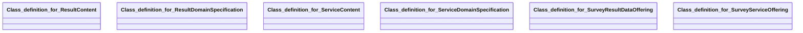

## survey Properties

### Class Diagram

### Class Hierarchy

- Class definition for ResultContent (https://w3id.org/gaia-x4plcaad/ontologies/survey/v6/ResultContent)
- Class definition for ResultDomainSpecification (https://w3id.org/gaia-x4plcaad/ontologies/survey/v6/ResultDomainSpecification)
- Class definition for ServiceContent (https://w3id.org/gaia-x4plcaad/ontologies/survey/v6/ServiceContent)
- Class definition for ServiceDomainSpecification (https://w3id.org/gaia-x4plcaad/ontologies/survey/v6/ServiceDomainSpecification)
- Class definition for SurveyResultDataOffering (https://w3id.org/gaia-x4plcaad/ontologies/survey/v6/SurveyResultDataOffering)
- Class definition for SurveyServiceOffering (https://w3id.org/gaia-x4plcaad/ontologies/survey/v6/SurveyServiceOffering)

### Class Definitions

|Class|IRI|Description|Parents|
|---|---|---|---|
|Class definition for ResultContent|https://w3id.org/gaia-x4plcaad/ontologies/survey/v6/ResultContent|Content properties for survey result data.|Content|
|Class definition for ResultDomainSpecification|https://w3id.org/gaia-x4plcaad/ontologies/survey/v6/ResultDomainSpecification|Domain-specific metadata for survey result data.|DomainSpecification|
|Class definition for ServiceContent|https://w3id.org/gaia-x4plcaad/ontologies/survey/v6/ServiceContent|Content properties for a survey service offering.|Content|
|Class definition for ServiceDomainSpecification|https://w3id.org/gaia-x4plcaad/ontologies/survey/v6/ServiceDomainSpecification|Domain-specific metadata for a survey service offering.|DomainSpecification|
|Class definition for SurveyResultDataOffering|https://w3id.org/gaia-x4plcaad/ontologies/survey/v6/SurveyResultDataOffering|The survey result refers to the data obtained from conducting the survey. It represents the collective responses gathered from all survey participants in relation to the specific topic of the survey.|SimulationAsset|
|Class definition for SurveyServiceOffering|https://w3id.org/gaia-x4plcaad/ontologies/survey/v6/SurveyServiceOffering|The survey service offering refers to the invitation to a participate in a survey.|ServiceAsset|

## Prefixes

- envited-x: <https://w3id.org/ascs-ev/envited-x/envited-x/v3/>
- manifest: <https://w3id.org/ascs-ev/envited-x/manifest/v5/>
- owl: <http://www.w3.org/2002/07/owl#>
- sh: <http://www.w3.org/ns/shacl#>
- skos: <http://www.w3.org/2004/02/skos/core#>
- survey: <https://w3id.org/gaia-x4plcaad/ontologies/survey/v6/>
- xsd: <http://www.w3.org/2001/XMLSchema#>

### SHACL Properties

#### survey:belongsTo {: #prop-https---w3id-org-gaia-x4plcaad-ontologies-survey-v6-belongsto .property-anchor }
#### survey:dataSize {: #prop-https---w3id-org-gaia-x4plcaad-ontologies-survey-v6-datasize .property-anchor }
#### survey:hasContent {: #prop-https---w3id-org-gaia-x4plcaad-ontologies-survey-v6-hascontent .property-anchor }
#### survey:hasDomainSpecification {: #prop-https---w3id-org-gaia-x4plcaad-ontologies-survey-v6-hasdomainspecification .property-anchor }
#### survey:hasManifest {: #prop-https---w3id-org-gaia-x4plcaad-ontologies-survey-v6-hasmanifest .property-anchor }
#### survey:hasResourceDescription {: #prop-https---w3id-org-gaia-x4plcaad-ontologies-survey-v6-hasresourcedescription .property-anchor }
#### survey:hasServiceOffering {: #prop-https---w3id-org-gaia-x4plcaad-ontologies-survey-v6-hasserviceoffering .property-anchor }
#### survey:surveyCloseTime {: #prop-https---w3id-org-gaia-x4plcaad-ontologies-survey-v6-surveyclosetime .property-anchor }
#### survey:surveyCreationTime {: #prop-https---w3id-org-gaia-x4plcaad-ontologies-survey-v6-surveycreationtime .property-anchor }
#### survey:surveyEndTime {: #prop-https---w3id-org-gaia-x4plcaad-ontologies-survey-v6-surveyendtime .property-anchor }
#### survey:surveyStartTime {: #prop-https---w3id-org-gaia-x4plcaad-ontologies-survey-v6-surveystarttime .property-anchor }
#### survey:surveyUrl {: #prop-https---w3id-org-gaia-x4plcaad-ontologies-survey-v6-surveyurl .property-anchor }

|Shape|Property prefix|Property|MinCount|MaxCount|Description|Datatype/NodeKind|Filename|
|---|---|---|---|---|---|---|---|
|SurveyResultDataOfferingShape|survey|hasResourceDescription|1|1|||survey-result-data-offering.shacl.ttl|
|SurveyResultDataOfferingShape|survey|hasDomainSpecification|1|1|||survey-result-data-offering.shacl.ttl|
|SurveyResultDataOfferingShape|survey|hasManifest|1|1|||survey-result-data-offering.shacl.ttl|
|ResultDomainSpecificationShape|survey|hasContent|1|1|||survey-result-data-offering.shacl.ttl|
|ResultContentShape|survey|surveyStartTime|1|1|When the survey was started.|<http://www.w3.org/2001/XMLSchema#dateTime>|survey-result-data-offering.shacl.ttl|
|ResultContentShape|survey|surveyCloseTime|1|1|When the survey was closed.|<http://www.w3.org/2001/XMLSchema#dateTime>|survey-result-data-offering.shacl.ttl|
|ResultContentShape|survey|belongsTo|1|1|Accompanied survey service offering.|<http://www.w3.org/ns/shacl#IRI>|survey-result-data-offering.shacl.ttl|
|ResultContentShape|survey|dataSize|0|1||<http://www.w3.org/2001/XMLSchema#float>|survey-result-data-offering.shacl.ttl|
|SurveyServiceOfferingShape|survey|hasServiceOffering|1|1|||survey-service-offering.shacl.ttl|
|SurveyServiceOfferingShape|survey|hasDomainSpecification|1|1|||survey-service-offering.shacl.ttl|
|SurveyServiceOfferingShape|survey|hasManifest|1|1|||survey-service-offering.shacl.ttl|
|ServiceDomainSpecificationShape|survey|hasContent|1|1|||survey-service-offering.shacl.ttl|
|ServiceContentShape|survey|surveyUrl|1|1||<http://www.w3.org/2001/XMLSchema#string>|survey-service-offering.shacl.ttl|
|ServiceContentShape|survey|surveyCreationTime|1|1|When the survey was created|<http://www.w3.org/2001/XMLSchema#dateTime>|survey-service-offering.shacl.ttl|
|ServiceContentShape|survey|surveyEndTime|1|1|When the survey will end automatically|<http://www.w3.org/2001/XMLSchema#dateTime>|survey-service-offering.shacl.ttl|
|ServiceContentShape|survey|dataSize|0|1||<http://www.w3.org/2001/XMLSchema#float>|survey-service-offering.shacl.ttl|
