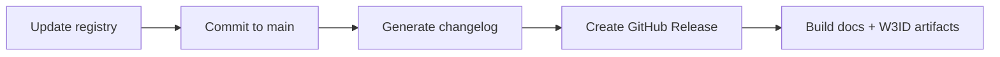

# Release Process

This guide describes how maintainers create a new release of the ontology repository.

## Prerequisites

Before creating a release, ensure:

- [ ] All PRs for the release are merged into `main`
- [ ] `pyproject.toml` version is updated (e.g., `version = "0.2.0"`)
- [ ] Validation passes: `make test`
- [ ] Pre-commit hooks pass: `make lint`

## Creating a Release

### Option A — Tag Push (Recommended)

Create a signed, annotated tag and push it. The release workflow triggers automatically.

```bash
git checkout main
git pull origin main
git tag -a -s v0.2.0 -m "v0.2.0"
git push origin v0.2.0
```

This is the preferred method because:

- The tag is GPG-signed and annotated (matches repository signing policy).
- The tag exists before the workflow runs, so changelog generation resolves the correct commit range.
- The tag is immutable — it points to the exact commit you reviewed.

### Option B — Manual Workflow Dispatch

Use the GitHub Actions UI when you need to re-run a release or the tag already exists.

1. Go to **Actions** → **Release** → **Run workflow**.
2. Enter the release tag (e.g., `v0.2.0`).
3. Click **Run workflow**.

!!! warning "Tag must exist first"
    If the tag does not yet exist as a git tag, the workflow creates a lightweight
    tag at the current `main` HEAD. Prefer Option A to get a signed, annotated tag.

## What the Workflow Does

The [`cd-release.yml`](https://github.com/ASCS-eV/ontology-management-base/blob/main/.github/workflows/cd-release.yml) workflow runs these steps in order:


```mermaid
flowchart LR
    A[Update registry] --> B[Commit to main]
    B --> C[Generate changelog]
    C --> D[Create GitHub Release]
    D --> E[Build docs + W3ID artifacts]
```

| Step | Detail |
|------|--------|
| **Update registry** | Runs `registry_updater` with `--release-tag` to update `docs/registry.json` |
| **Commit to main** | Pushes the registry update back to `main` (skips CI) |
| **Generate changelog** | Uses [git-cliff](https://git-cliff.org/) with `cliff.toml` to produce release notes from conventional commits |
| **Create GitHub Release** | Publishes the release on GitHub with the generated notes |
| **Build docs + W3ID** | Triggers `cd-docs.yml` to build documentation and versioned W3ID artifacts from the immutable tag |

### Publishing to PyPI

Publishing the package to [PyPI](https://pypi.org/p/ontology-management-base) is handled
by a separate workflow, [`cd-pypi.yml`](https://github.com/ASCS-eV/ontology-management-base/blob/main/.github/workflows/cd-pypi.yml),
which triggers when a GitHub Release is **published** (so it runs after `cd-release.yml`
creates the release). It builds the sdist and wheel, verifies the `pyproject.toml`
version matches the release tag, and uploads to PyPI using
[trusted publishing](https://docs.pypi.org/trusted-publishers/) (OIDC — no API tokens).

The publish step runs in the repository's `pypi` GitHub Actions environment, which must
exist in **Settings → Environments** (restricting it to release tags / protected refs is
recommended). No secrets are required; the `id-token: write` permission plus the
configured PyPI trusted publisher authorize the upload.

## Versioning

The repository uses [Semantic Versioning](https://semver.org/):

| Change | Bump | Example |
|--------|------|---------|
| Bug fix or non-breaking ontology correction | Patch | `v0.1.3` → `v0.1.4` |
| New domain or backward-compatible additions | Minor | `v0.1.4` → `v0.2.0` |
| Breaking change (existing Self-Descriptions become invalid) | Major | `v0.2.0` → `v1.0.0` |

Update the version in `pyproject.toml` before tagging — this is the **single source
of truth** for the package version:

```toml
[project]
version = "0.3.0"
```

Everything else derives from it and must **not** be edited by hand:

- `omb/__init__.py` reads `__version__` from the installed package metadata.
- `config/ontoenv.toml` is regenerated from `pyproject.toml` by `registry_updater`.

The release tag must match: for `version = "0.3.0"`, tag `v0.3.0`. The PyPI publish
workflow fails fast if the tag and `pyproject.toml` version disagree.

## Changelog Generation

Release notes are auto-generated from [Conventional Commits](https://www.conventionalcommits.org/) using [git-cliff](https://git-cliff.org/). Commit prefixes map to sections:

| Prefix | Section |
|--------|---------|
| `feat:` | Features |
| `fix:` | Bug Fixes |
| `docs:` | Documentation |
| `refactor:` | Refactoring |
| `test:` | Testing |
| `ci:` | CI/CD |
| `chore:` | Maintenance |

Configuration lives in [`cliff.toml`](https://github.com/ASCS-eV/ontology-management-base/blob/main/cliff.toml).

## Post-Release Verification

After the workflow completes, verify:

- [GitHub Release](https://github.com/ASCS-eV/ontology-management-base/releases) exists with correct notes
- `docs/registry.json` on `main` reflects the new tag
- [Documentation site](https://ascs-ev.github.io/ontology-management-base/) is updated
- W3ID IRIs resolve (e.g., `https://w3id.org/ascs-ev/envited-x/{domain}/v{n}`)
